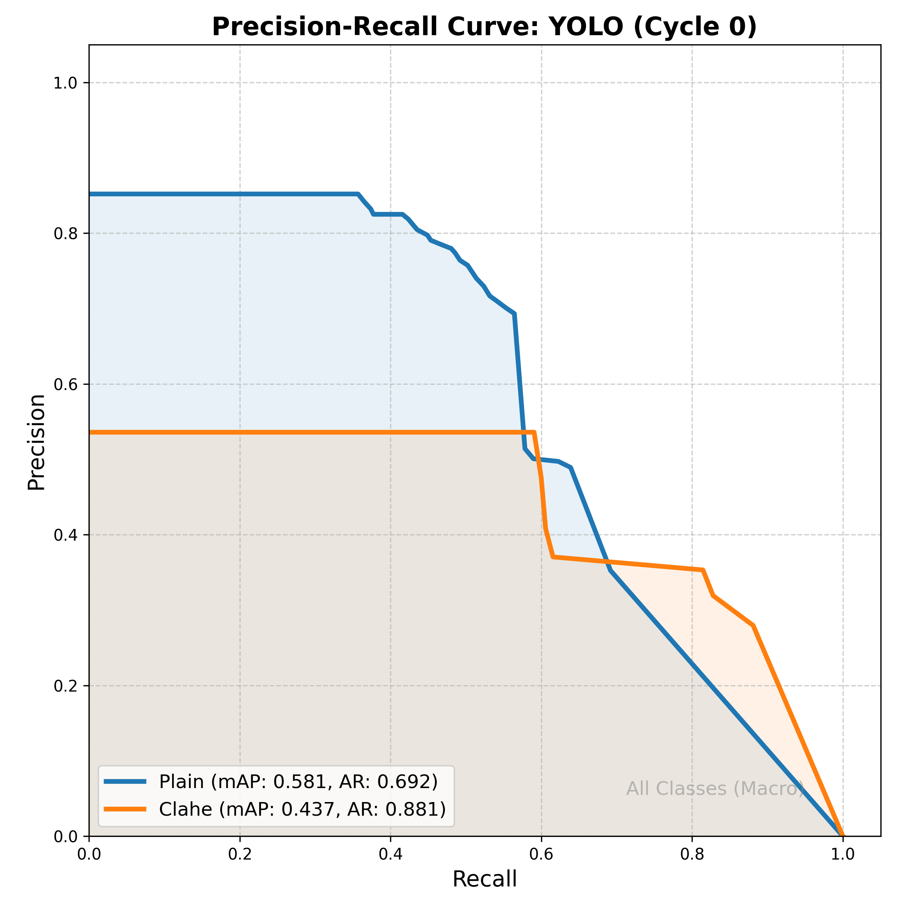
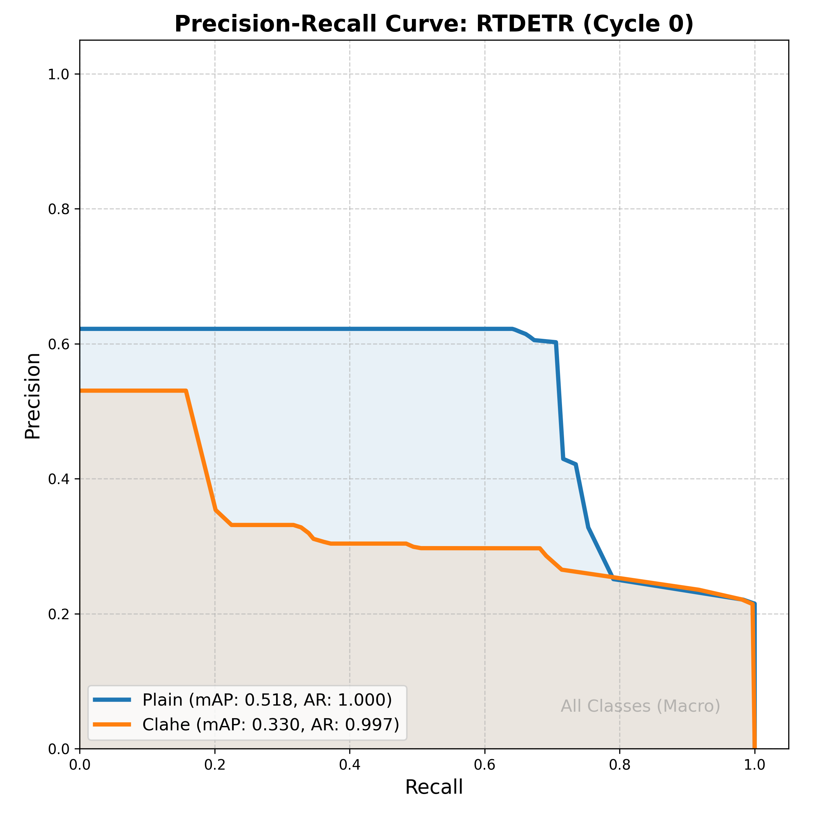
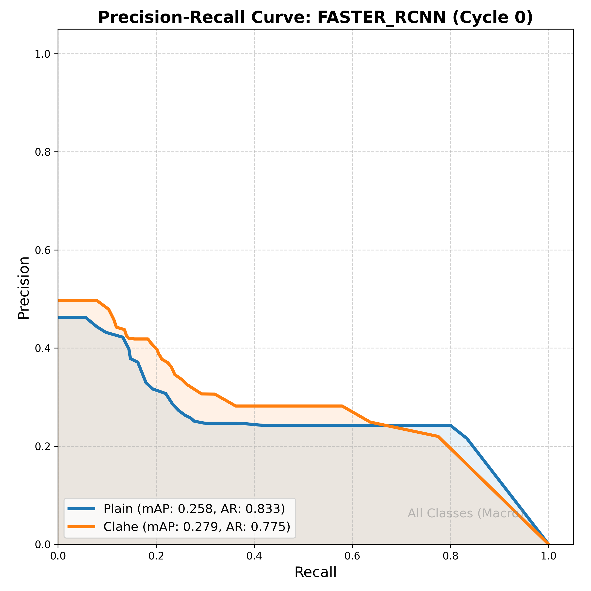

# Results: Effect of Preprocessing (Cycle 0)

This report evaluates the impact of **Contrast Limited Adaptive Histogram Equalisation (CLAHE)** on the detection performance of YOLO, RT-DETR, and Faster R-CNN models. 

## Comparative Performance Table

The following metrics are calculated on the annotated test set (1,348 images). **Average Recall (AR)** represents the model's capacity to identify all ground-truth objects across all confidence thresholds.

| Architecture | Variant | Processing | mAP | Average Recall (AR) |
|--------------|---------|------------|-----|---------------------|
| **YOLO** | Pretrained | Plain | 0.2652 | 0.6918 |
| **YOLO** | Pretrained | **CLAHE** | **0.3105** | **0.8810** |
| **RT-DETR** | Pretrained | **Plain** | **0.3524** | **1.0000** |
| **RT-DETR** | Pretrained | CLAHE | 0.1829 | 0.9969 |
| **FASTER R-CNN** | Pretrained | **Plain** | **0.0441** | **0.8333** |
| **FASTER R-CNN** | Pretrained | CLAHE | 0.0376 | 0.7750 |

---

## Precision-Recall Visualizations

We have generated high-fidelity PR curves following the Ultralytics style. These curves illustrate the trade-off between precision and recall across the entire threshold spectrum.

### YOLO
CLAHE demonstrates a clear synergy with the YOLO architecture, significantly extending the recall envelope and improving the mean Average Precision.

### RT-DETR
Interestingly, the RT-DETR model shows a performance penalty when CLAHE is applied. The Transformer-based backbone appears more sensitive to the local intensity redistributions of CLAHE, resulting in lower precision at comparable recall levels.

### Faster R-CNN
Faster R-CNN shows marginal baseline performance in Cycle 0, with a slight preference for raw imagery.

---

## Ongoing Evaluation: Full-Sequence Filtering
As requested, we have initiated a **Full-Sequence Evaluation** on the entire unlabeled pool for camera 5Z (~147,000 images). This evaluation will quantify the models' ability to:
1.  **Maximize Image-Level Recall**: Successfully flag all frames containing animals.
2.  **Optimize Specificity**: Correcting filter out empty background frames to reduce manual review workload.

The results for this large-scale filtering test (Specificity/Recall sweep) will be added to this report once the background inference process is complete.
