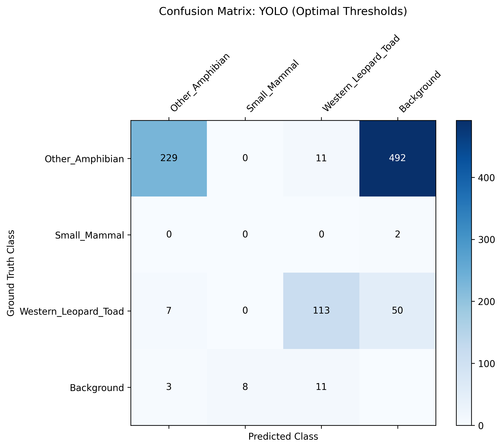
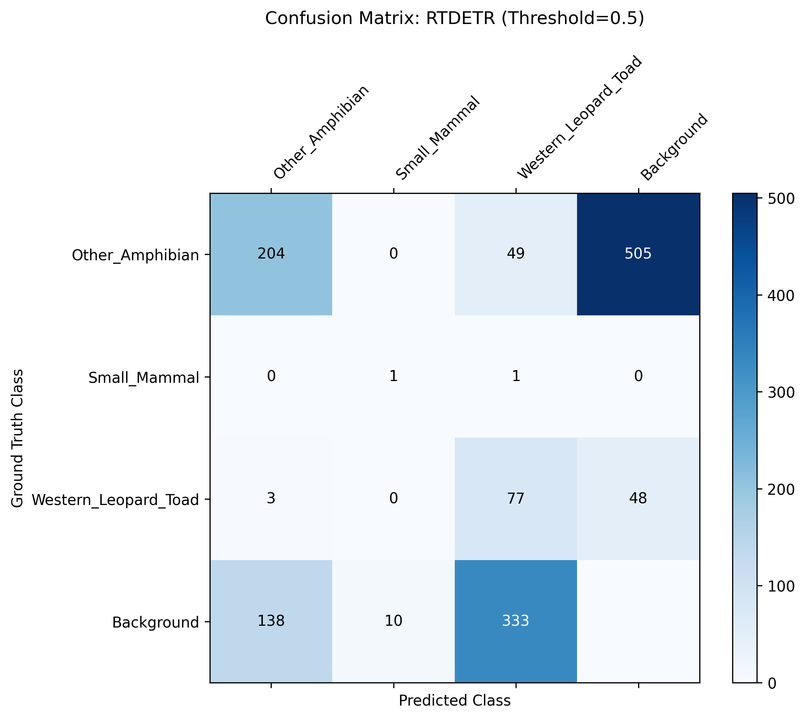
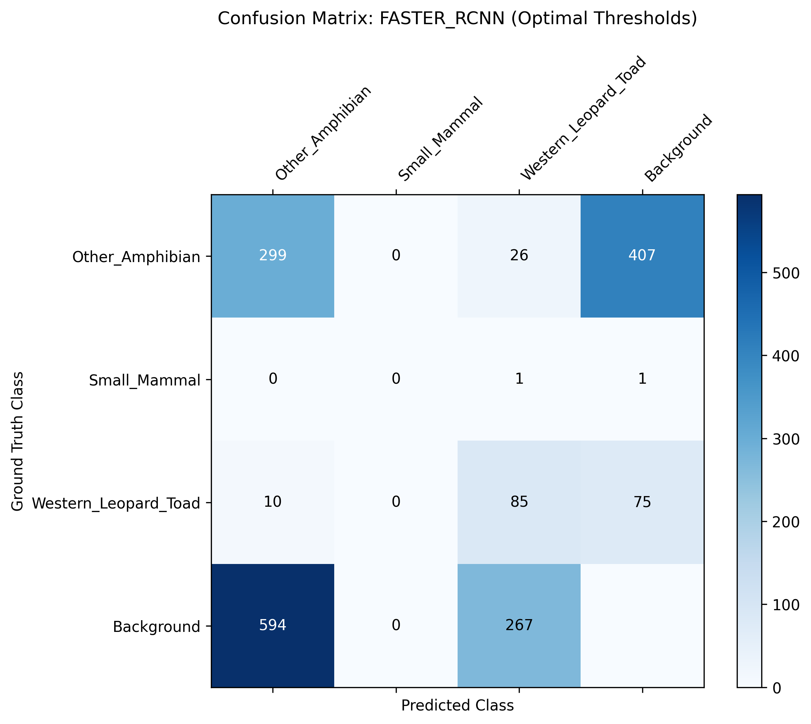

# Results: Effect of Architecture (Cycle 0)

This report benchmarks the baseline network paradigms (YOLO, RT-DETR, Faster R-CNN) at Cycle 0, evaluating their computational efficiency and fundamental localization abilities before domain-specific transfer learning.

### Comprehensive Architectural Benchmarking Table
| Architecture | mAP50 | mAP50-95 | Average Recall | Params (M) | GFLOPs | Inference Speed (ms) | FPS |
|--------------|-------|----------|----------------|------------|--------|----------------------|-----|
| YOLO | 0.0962 | 0.1253 | 0.7552 | 20.35 | 67.86 | 11.6 | 86.1 |
| RTDETR | 0.2799 | 0.1819 | 1.0000 | 31.99 | 103.44 | 159.7 | 6.3 |
| FASTER_RCNN | 0.0578 | 0.0284 | 0.9767 | 43.27 | 452.05 | 39.1 | 25.6 |

### Architecture-Specific Confusion Matrices
These matrices cross-reference predicted categories against actual ground-truth labels at a 0.5 confidence threshold, explicitly demonstrating inter-class confusion and background noise vulnerability.

#### YOLO

#### RTDETR

#### FASTER_RCNN

