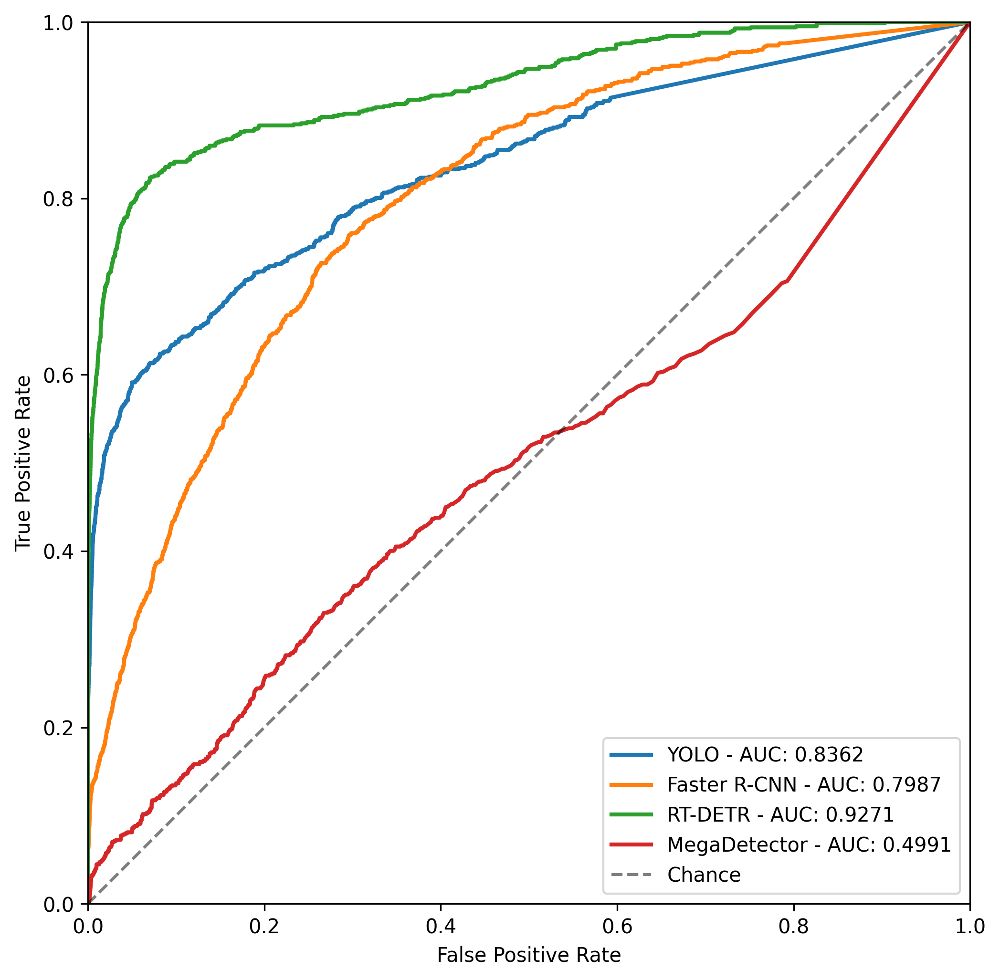
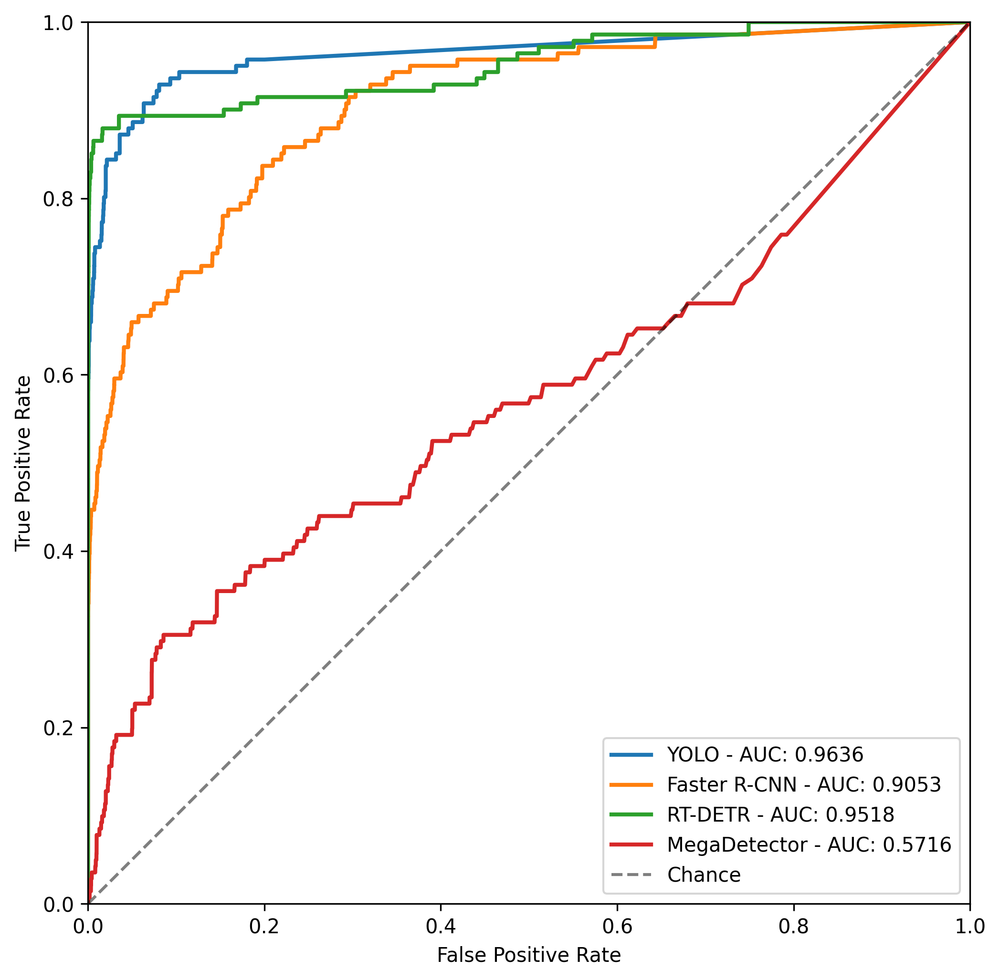

# Results: Image-Level Binary Classification & Labor Reduction (Cycle 0)

This report documents the image-level binary filtering performance and manual annotation labor reduction achieved by baseline models on the unlabelled test pool (147,351 frames).

For each model, we evaluate performance at three separate operating points:
1.  **Optimal $F_1$-Score Operating Point**: Maximizes the geometric mean of Precision and Recall. Recommended for general machine learning model comparisons.
2.  **High-Recall Safety Operating Point (Target $\ge 95\%$)**: Restricts the search space to configurations that guarantee at least $95\%$ target recall, and maximizes specificity. Recommended for risk-averse ecological deployment where target species must not be missed.
3.  **Moderate High-Recall Operating Point (Target $\ge 85\%$)**: Restricts the search space to configurations that guarantee at least $85\%$ target recall, and maximizes specificity. Offers a balanced compromise with higher specificity and labor savings where acceptable.

## 1. Class-Agnostic Evaluation (General Animal vs. Empty Background)

In this configuration, any animal detection of any taxon is treated as positive. This is highly robust to night-time taxonomic misclassification and allows a direct, fair benchmark against **MegaDetector v5a**.

| Baseline Model | Area Under ROC (AUC) | Metric Focus | Optimal Conf. Threshold | Achieved F1-Score | Achieved Recall (Sensitivity) | Achieved Specificity (TNR) | Achieved Precision | Manual Labor Saved |
|---|---|---|---|---|---|---|---|---|
| **YOLO** | **0.8362** | Max $F_1$-Score | 0.63 | 0.3627 | 34.34% | 99.69% | 38.43% | **99.50%** |
| | | High-Recall ($\ge 95\%$) | N/A | N/A | N/A | N/A | N/A | **N/A (Max Rec: 65.8%)** |
| | | High-Recall ($\ge 85\%$) | N/A | N/A | N/A | N/A | N/A | **N/A (Max Rec: 65.8%)** |
| | | | | | | | | |
| **Faster R-CNN** | **0.7987** | Max $F_1$-Score | 0.92 | 0.1444 | 11.25% | 99.75% | 20.17% | **99.69%** |
| | | High-Recall ($\ge 95\%$) | 0.01 | 0.0137 | 97.58% | 20.95% | 0.69% | **20.85%** |
| | | High-Recall ($\ge 85\%$) | 0.11 | 0.0214 | 86.09% | 55.67% | 1.08% | **55.43%** |
| | | | | | | | | |
| **RT-DETR** | **0.9271** | Max $F_1$-Score | 0.89 | 0.5196 | 44.01% | 99.86% | 63.41% | **99.61%** |
| | | High-Recall ($\ge 95\%$) | 0.07 | 0.0155 | 98.79% | 29.40% | 0.78% | **29.24%** |
| | | High-Recall ($\ge 85\%$) | 0.24 | 0.0685 | 85.37% | 86.98% | 3.57% | **86.58%** |
| | | | | | | | | |
| **MegaDetector** | **0.4991** | Max $F_1$-Score | 0.33 | 0.0339 | 3.26% | 99.50% | 3.53% | **99.48%** |
| | | High-Recall ($\ge 95\%$) | N/A | N/A | N/A | N/A | N/A | **N/A (Max Rec: 45.8%)** |
| | | High-Recall ($\ge 85\%$) | N/A | N/A | N/A | N/A | N/A | **N/A (Max Rec: 45.8%)** |
| | | | | | | | | |

### Class-Agnostic ROC Curve Visualization

## 2. Class-Specific Evaluation (Western Leopard Toad vs. Background/Other Taxa)

In this configuration, only annotations containing the target species (**Western Leopard Toad**) are treated as positive. For fine-tuned custom models, only predictions of Class 2 (`Western_Leopard_Toad`) trigger a positive flag. For the zero-shot **MegaDetector**, all animal detections trigger a positive flag (as it is class-agnostic), but performance is measured strictly against target toad presence.

| Baseline Model | Area Under ROC (AUC) | Metric Focus | Optimal Conf. Threshold | Achieved F1-Score | Achieved Recall (Sensitivity) | Achieved Specificity (TNR) | Achieved Precision | Manual Labor Saved |
|---|---|---|---|---|---|---|---|---|
| **YOLO** | **0.9636** | Max $F_1$-Score | 0.76 | 0.6847 | 53.90% | 100.00% | 93.83% | **99.95%** |
| | | High-Recall ($\ge 95\%$) | N/A | N/A | N/A | N/A | N/A | **N/A (Max Rec: 87.2%)** |
| | | High-Recall ($\ge 85\%$) | 0.01 | 0.0368 | 87.23% | 95.63% | 1.88% | **95.56%** |
| | | | | | | | | |
| **Faster R-CNN** | **0.9053** | Max $F_1$-Score | 0.95 | 0.4412 | 31.91% | 99.99% | 71.43% | **99.96%** |
| | | High-Recall ($\ge 95\%$) | 0.07 | 0.0041 | 95.74% | 55.80% | 0.21% | **55.75%** |
| | | High-Recall ($\ge 85\%$) | 0.24 | 0.0073 | 85.11% | 77.77% | 0.37% | **77.71%** |
| | | | | | | | | |
| **RT-DETR** | **0.9518** | Max $F_1$-Score | 0.92 | 0.6168 | 70.21% | 99.94% | 55.00% | **99.88%** |
| | | High-Recall ($\ge 95\%$) | 0.04 | 0.0027 | 98.58% | 30.65% | 0.14% | **30.62%** |
| | | High-Recall ($\ge 85\%$) | 0.66 | 0.2673 | 85.11% | 99.57% | 15.85% | **99.49%** |
| | | | | | | | | |
| **MegaDetector** | **0.5716** | Max $F_1$-Score | 0.92 | 0.0136 | 0.71% | 100.00% | 16.67% | **100.00%** |
| | | High-Recall ($\ge 95\%$) | N/A | N/A | N/A | N/A | N/A | **N/A (Max Rec: 53.2%)** |
| | | High-Recall ($\ge 85\%$) | N/A | N/A | N/A | N/A | N/A | **N/A (Max Rec: 53.2%)** |
| | | | | | | | | |

### WLT-Specific ROC Curve Visualization

