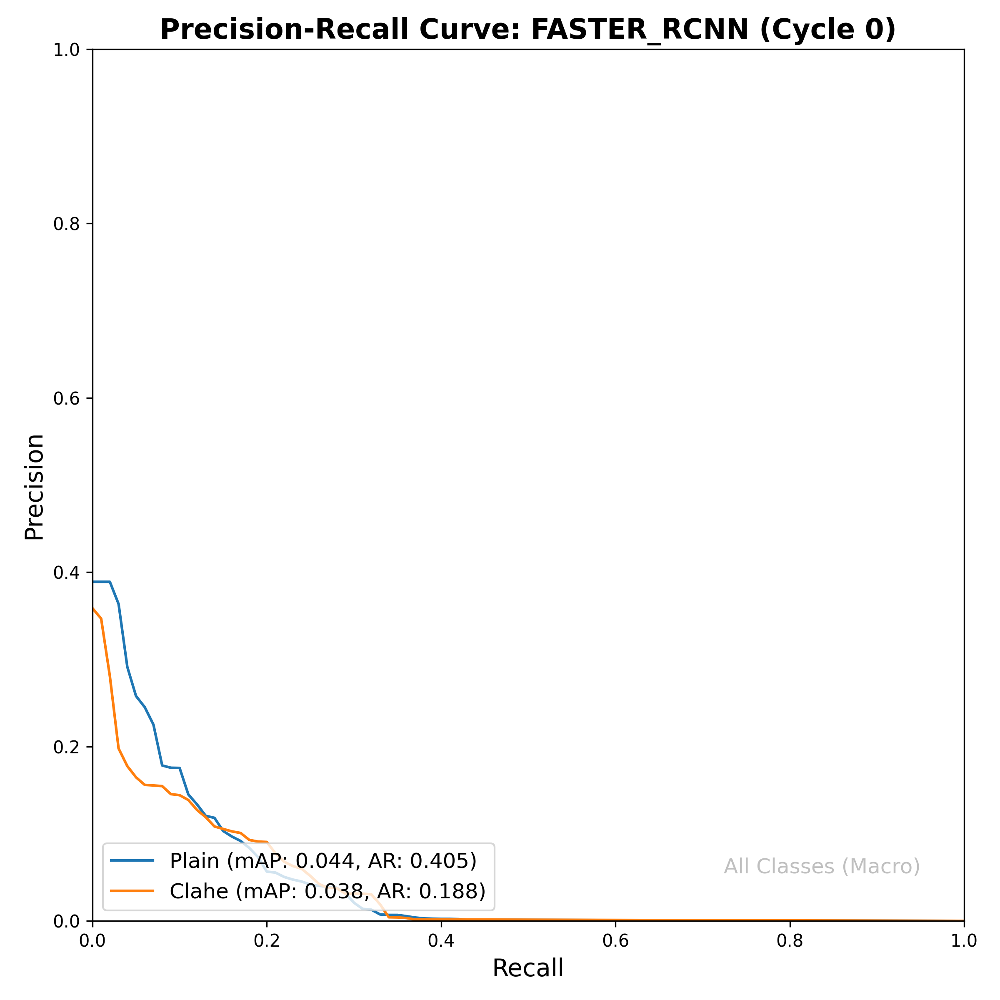
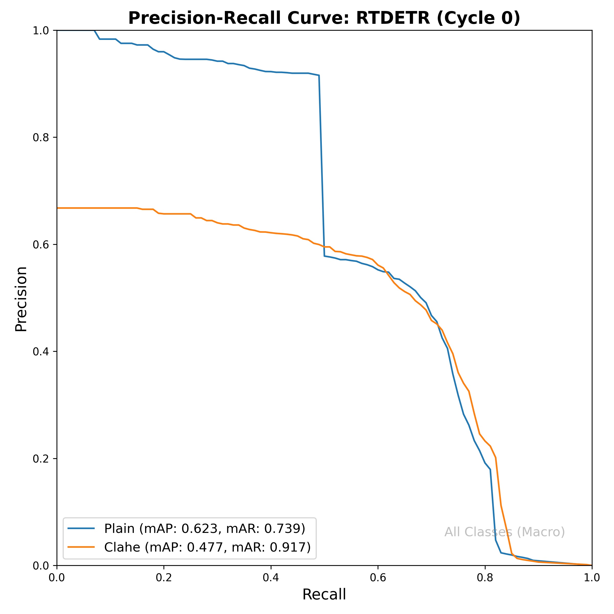
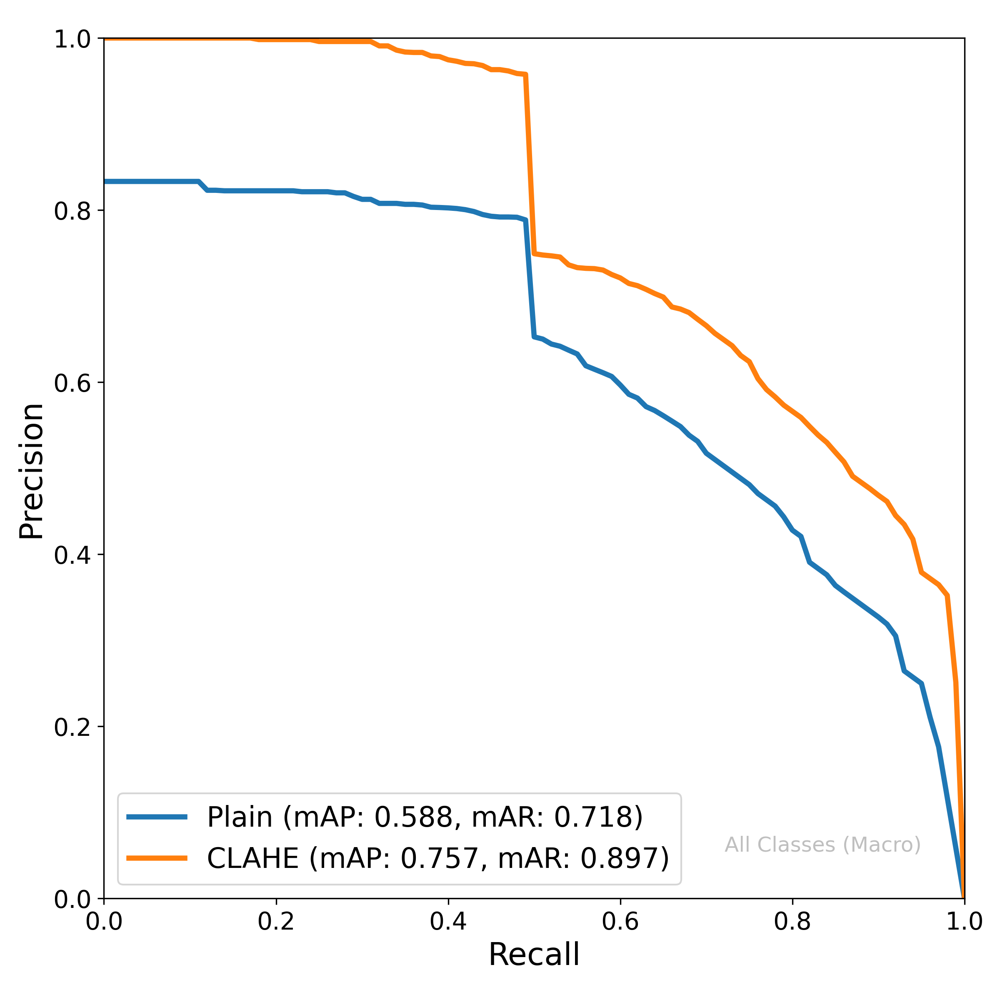

# Results: Effect of Preprocessing (Cycle 0)

This report summarizes the impact of CLAHE on Cycle 0 model performance.

### Comparative Performance Table (Cycle 0, Test Set)
| Architecture | Variant | Processing | mAP | mean Average Recall |
|--------------|---------|------------|-----|---------------------|
| FASTER_RCNN | Pretrained | Clahe | 0.1735 | 0.3406 |
| FASTER_RCNN | Pretrained | Clahe | 0.2315 | 0.4253 |
| FASTER_RCNN | Pretrained | Plain | 0.1768 | 0.3597 |
| FASTER_RCNN | Pretrained | Plain | 0.1947 | 0.4091 |
| FASTER_RCNN | Scratch | Clahe | 0.3096 | 0.4581 |
| FASTER_RCNN | Scratch | Plain | 0.3443 | 0.5021 |
| RTDETR | Pretrained | Clahe | 0.5511 | 0.4892 |
| RTDETR | Pretrained | Clahe | 0.5411 | 0.5332 |
| RTDETR | Pretrained | Plain | 0.5676 | 0.5205 |
| RTDETR | Pretrained | Plain | 0.6950 | 0.6683 |
| RTDETR | Scratch | Clahe | 0.6572 | 0.5526 |
| RTDETR | Scratch | Plain | 0.5530 | 0.5189 |
| YOLO | Pretrained | Clahe | 0.8904 | 0.8189 |
| YOLO | Pretrained | Clahe | 0.8864 | 0.8013 |
| YOLO | Pretrained | Plain | 0.6372 | 0.6645 |
| YOLO | Pretrained | Plain | 0.6376 | 0.6149 |
| YOLO | Scratch | Clahe | 0.5201 | 0.3938 |
| YOLO | Scratch | Plain | 0.5355 | 0.3925 |

### Precision-Recall Visualizations

#### FASTER_RCNN

#### RTDETR

#### YOLO

