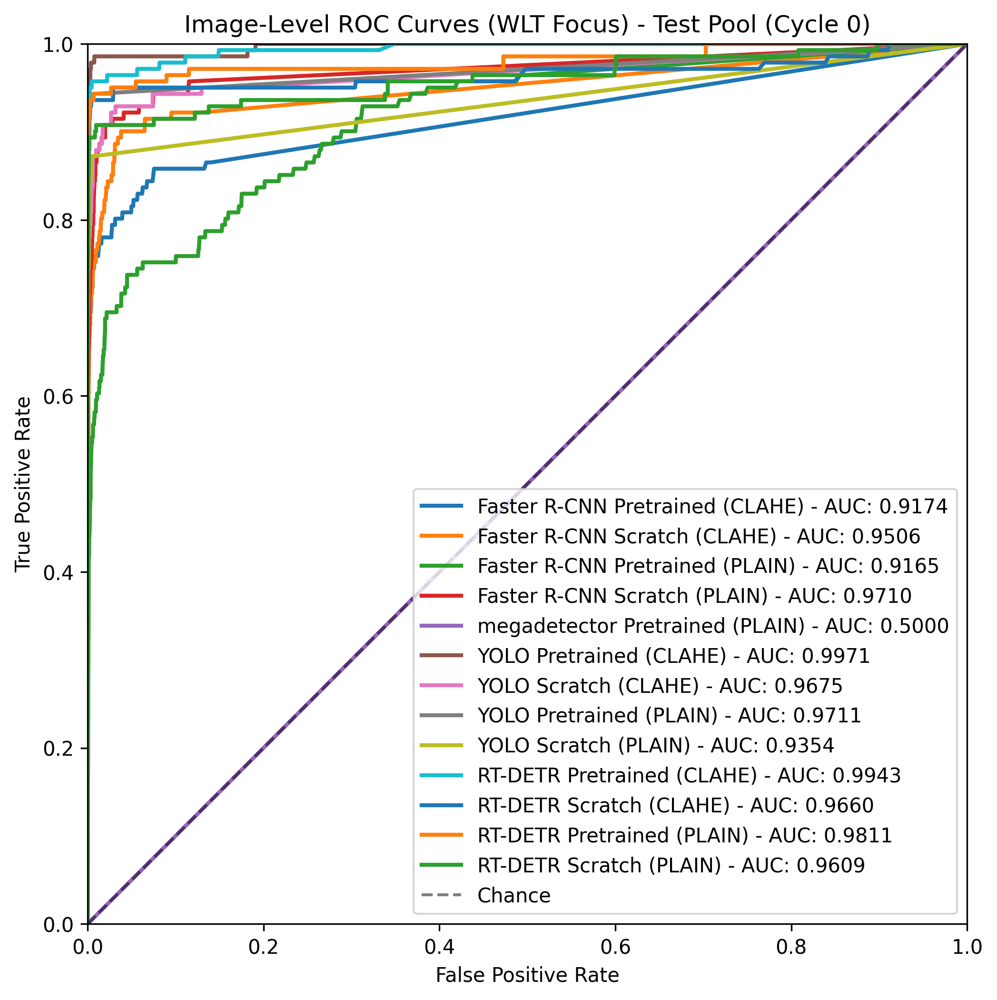
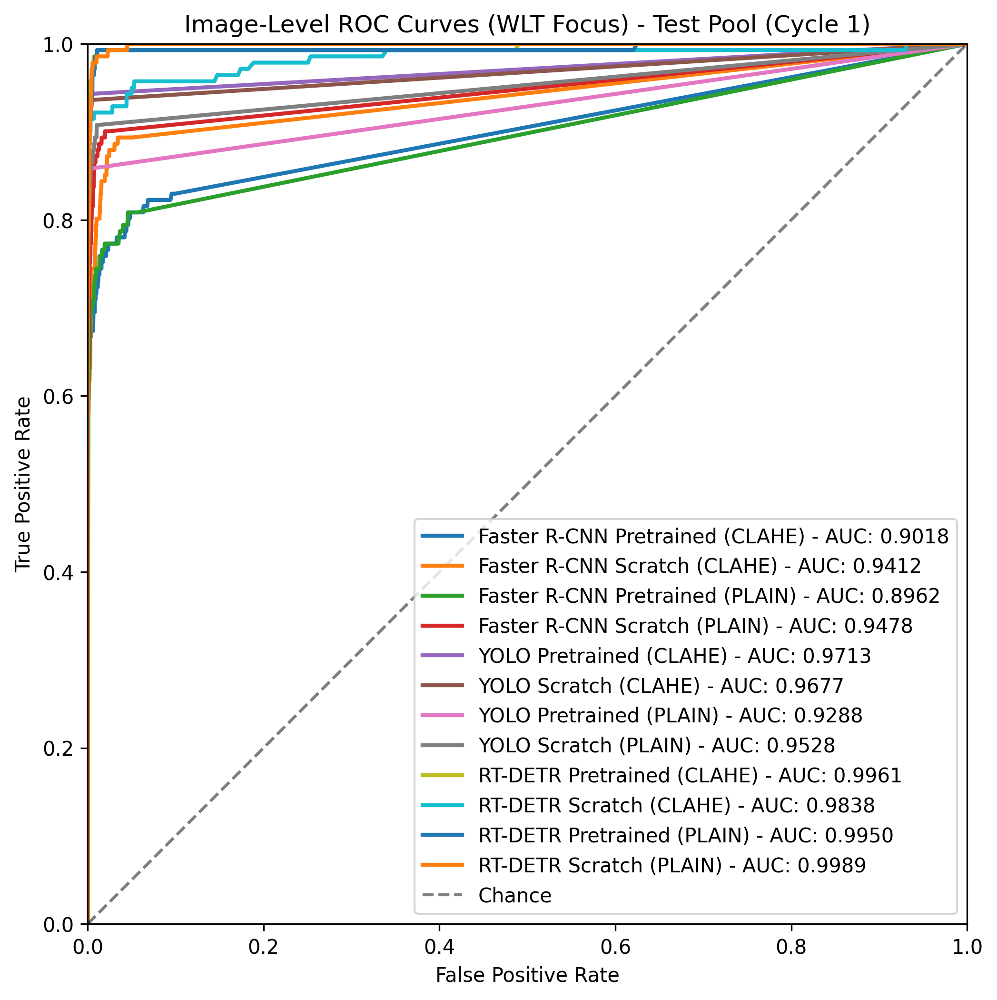
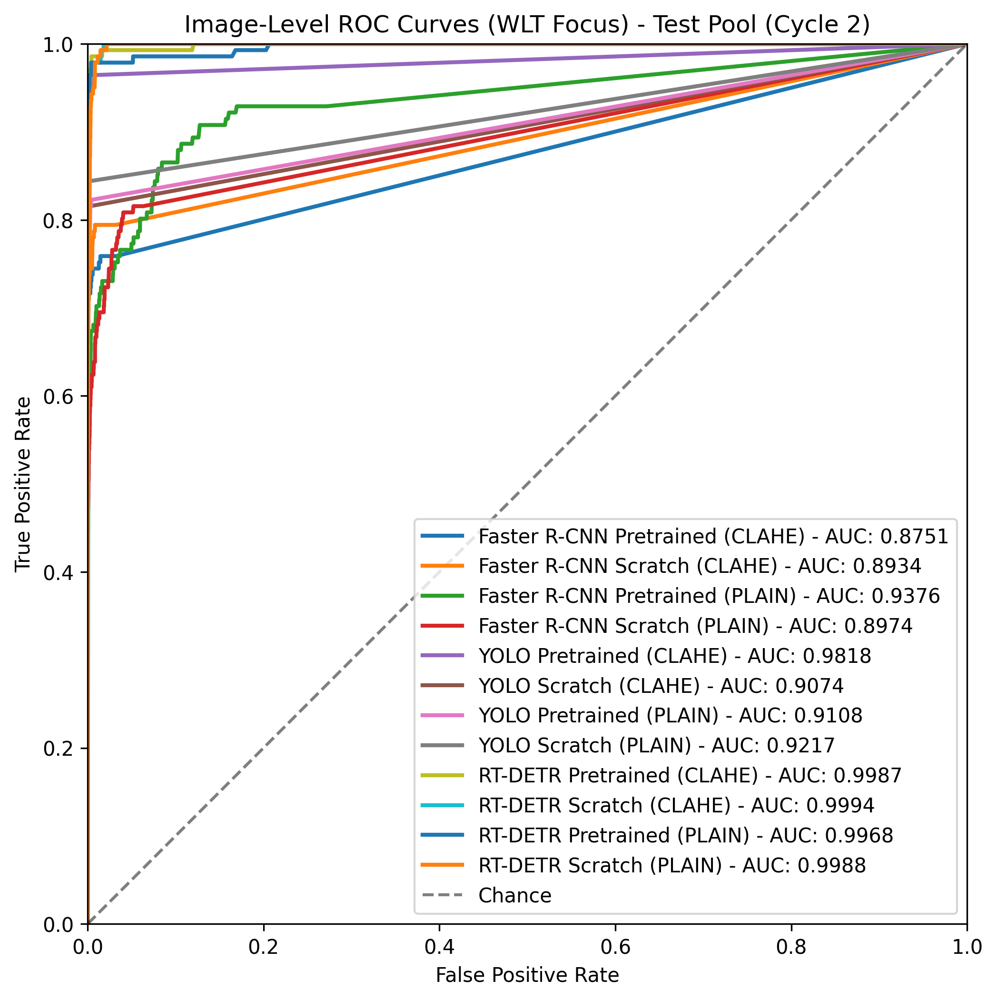
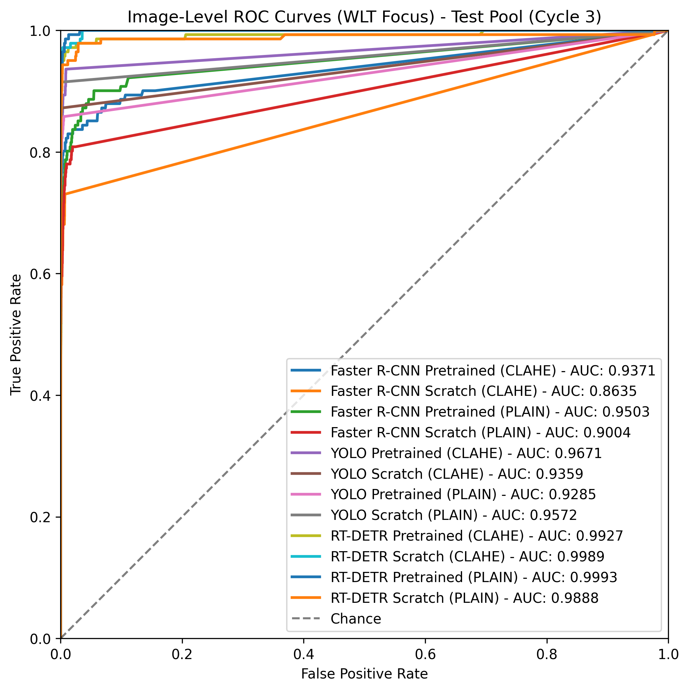
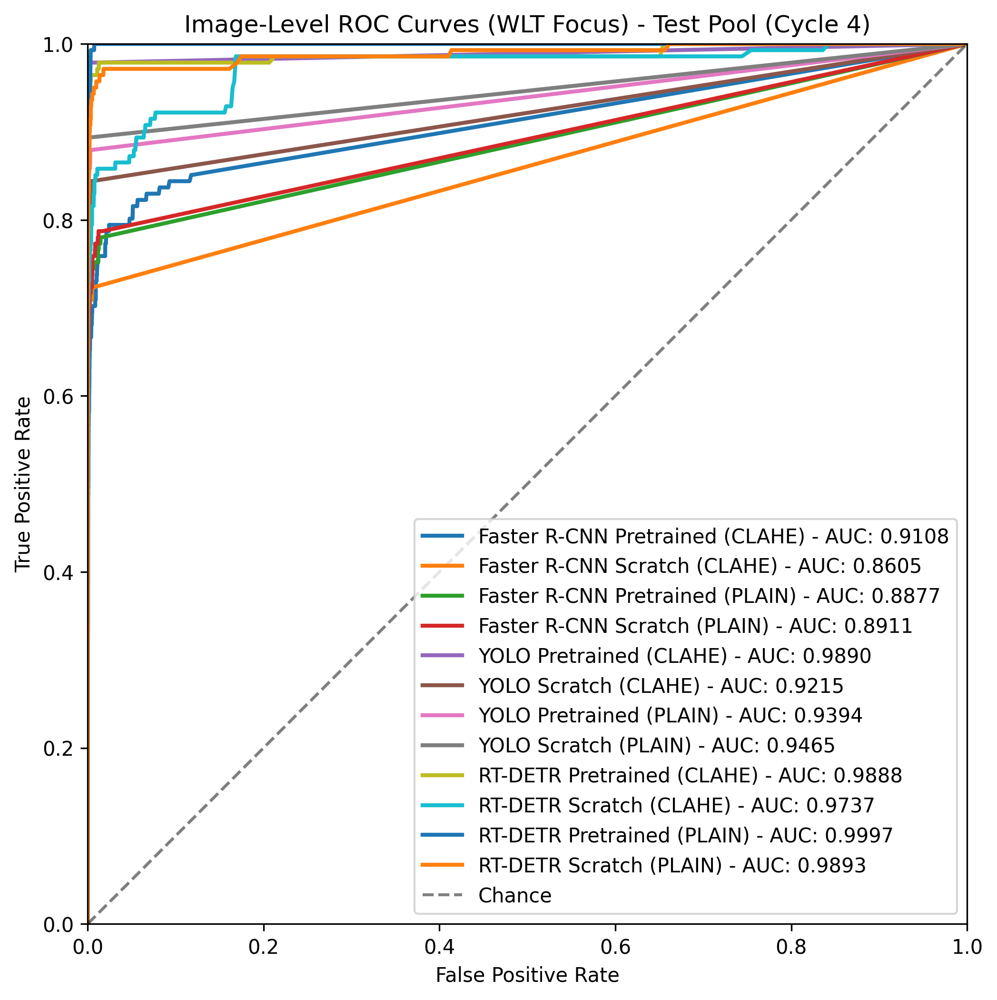

# Results: WLT-Specific Image-Level Binary Classification & Labor Reduction

This report documents the image-level binary filtering performance and manual annotation labor reduction achieved by custom models focusing strictly on the **Western Leopard Toad (WLT)** class on the unlabelled test pool (147,352 frames).

For each combination, we evaluate performance at multiple separate operating points:
1.  **Optimal $F_1$-Score**: Maximizes the geometric mean of Precision and Recall.
2.  **Optimal $F_2$-Score**: Heavily weights Recall to minimize false negatives.
3.  **Min ROC Distance**: Minimizes the Euclidean distance to the perfect classification corner (0, 1) on the ROC curve.
4.  **High-Recall Safety (Target $\ge 95\%$)**: Restricts the search space to configurations that guarantee at least $95\%$ target recall, and maximizes specificity.
5.  **Moderate High-Recall (Target $\ge 85\%$)**: Restricts the search space to configurations that guarantee at least $85\%$ target recall, and maximizes specificity.

## Active Learning Cycle 0

| Model | Process | Variant | Area Under ROC (AUC) | Metric Focus | Conf. Thresh | TP | FP | TN | FN | Recall | Specificity | Precision | F1-Score | Labor Saved |
|---|---|---|---|---|---|---|---|---|---|---|---|---|---|---|
| **FASTER_RCNN** | CLAHE | Pretrained | **0.9174** | Max $F_1$ | 0.85 | 64 | 43 | 147168 | 77 | 45.39% | 99.97% | 59.81% | 0.5161 | **99.93%** |
| | | | | Max $F_2$ | 0.59 | 87 | 135 | 147076 | 54 | 61.70% | 99.91% | 39.19% | 0.4793 | **99.85%** |
| | | | | Min ROC Dist | 0.01 | 122 | 20598 | 126613 | 19 | 86.52% | 86.01% | 0.59% | 0.0117 | **85.94%** |
| | | | | Recall $\ge 95\%$ | N/A | - | - | - | - | N/A | N/A | N/A | N/A | **N/A (Max Rec: 86.5%)** |
| | | | | Recall $\ge 85\%$ | 0.01 | 122 | 20598 | 126613 | 19 | 86.52% | 86.01% | 0.59% | 0.0117 | **85.94%** |
| | | | | | | | | | | | | | | |
| **FASTER_RCNN** | CLAHE | Scratch | **0.9506** | Max $F_1$ | 0.89 | 66 | 43 | 147168 | 75 | 46.81% | 99.97% | 60.55% | 0.5280 | **99.93%** |
| | | | | Max $F_2$ | 0.72 | 83 | 117 | 147094 | 58 | 58.87% | 99.92% | 41.50% | 0.4868 | **99.86%** |
| | | | | Min ROC Dist | 0.04 | 123 | 4491 | 142720 | 18 | 87.23% | 96.95% | 2.67% | 0.0517 | **96.87%** |
| | | | | Recall $\ge 95\%$ | N/A | - | - | - | - | N/A | N/A | N/A | N/A | **N/A (Max Rec: 92.2%)** |
| | | | | Recall $\ge 85\%$ | 0.04 | 123 | 4491 | 142720 | 18 | 87.23% | 96.95% | 2.67% | 0.0517 | **96.87%** |
| | | | | | | | | | | | | | | |
| **FASTER_RCNN** | PLAIN | Pretrained | **0.9165** | Max $F_1$ | 0.85 | 59 | 200 | 147011 | 82 | 41.84% | 99.86% | 22.78% | 0.2950 | **99.82%** |
| | | | | Max $F_2$ | 0.85 | 59 | 200 | 147011 | 82 | 41.84% | 99.86% | 22.78% | 0.2950 | **99.82%** |
| | | | | Min ROC Dist | 0.04 | 111 | 21479 | 125732 | 30 | 78.72% | 85.41% | 0.51% | 0.0102 | **85.35%** |
| | | | | Recall $\ge 95\%$ | 0.01 | 136 | 73298 | 73913 | 5 | 96.45% | 50.21% | 0.19% | 0.0037 | **50.16%** |
| | | | | Recall $\ge 85\%$ | 0.01 | 136 | 73298 | 73913 | 5 | 96.45% | 50.21% | 0.19% | 0.0037 | **50.16%** |
| | | | | | | | | | | | | | | |
| **FASTER_RCNN** | PLAIN | Scratch | **0.9710** | Max $F_1$ | 0.85 | 71 | 25 | 147185 | 70 | 50.35% | 99.98% | 73.96% | 0.5992 | **99.93%** |
| | | | | Max $F_2$ | 0.69 | 88 | 78 | 147132 | 53 | 62.41% | 99.95% | 53.01% | 0.5733 | **99.89%** |
| | | | | Min ROC Dist | 0.04 | 128 | 4080 | 143130 | 13 | 90.78% | 97.23% | 3.04% | 0.0589 | **97.14%** |
| | | | | Recall $\ge 95\%$ | 0.01 | 135 | 17252 | 129958 | 6 | 95.74% | 88.28% | 0.78% | 0.0154 | **88.20%** |
| | | | | Recall $\ge 85\%$ | 0.11 | 122 | 1476 | 145734 | 19 | 86.52% | 99.00% | 7.63% | 0.1403 | **98.92%** |
| | | | | | | | | | | | | | | |
| **MEGADETECTOR** | PLAIN | Pretrained | **0.5000** | Max $F_1$ | 0.01 | 0 | 0 | 147210 | 141 | 0.00% | 100.00% | 0.00% | 0.0000 | **100.00%** |
| | | | | Max $F_2$ | 0.01 | 0 | 0 | 147210 | 141 | 0.00% | 100.00% | 0.00% | 0.0000 | **100.00%** |
| | | | | Min ROC Dist | 0.01 | 0 | 0 | 147210 | 141 | 0.00% | 100.00% | 0.00% | 0.0000 | **100.00%** |
| | | | | Recall $\ge 95\%$ | N/A | - | - | - | - | N/A | N/A | N/A | N/A | **N/A (Max Rec: 0.0%)** |
| | | | | Recall $\ge 85\%$ | N/A | - | - | - | - | N/A | N/A | N/A | N/A | **N/A (Max Rec: 0.0%)** |
| | | | | | | | | | | | | | | |
| **RTDETR** | CLAHE | Pretrained | **0.9943** | Max $F_1$ | 0.85 | 98 | 35 | 147176 | 43 | 69.50% | 99.98% | 73.68% | 0.7153 | **99.91%** |
| | | | | Max $F_2$ | 0.66 | 120 | 100 | 147111 | 21 | 85.11% | 99.93% | 54.55% | 0.6648 | **99.85%** |
| | | | | Min ROC Dist | 0.20 | 135 | 756 | 146455 | 6 | 95.74% | 99.49% | 15.15% | 0.2616 | **99.40%** |
| | | | | Recall $\ge 95\%$ | 0.27 | 134 | 376 | 146835 | 7 | 95.04% | 99.74% | 26.27% | 0.4117 | **99.65%** |
| | | | | Recall $\ge 85\%$ | 0.66 | 120 | 100 | 147111 | 21 | 85.11% | 99.93% | 54.55% | 0.6648 | **99.85%** |
| | | | | | | | | | | | | | | |
| **RTDETR** | CLAHE | Scratch | **0.9660** | Max $F_1$ | 0.89 | 104 | 49 | 147162 | 37 | 73.76% | 99.97% | 67.97% | 0.7075 | **99.90%** |
| | | | | Max $F_2$ | 0.82 | 119 | 132 | 147079 | 22 | 84.40% | 99.91% | 47.41% | 0.6071 | **99.83%** |
| | | | | Min ROC Dist | 0.37 | 132 | 624 | 146587 | 9 | 93.62% | 99.58% | 17.46% | 0.2943 | **99.49%** |
| | | | | Recall $\ge 95\%$ | 0.14 | 134 | 6266 | 140945 | 7 | 95.04% | 95.74% | 2.09% | 0.0410 | **95.66%** |
| | | | | Recall $\ge 85\%$ | 0.79 | 120 | 161 | 147050 | 21 | 85.11% | 99.89% | 42.70% | 0.5687 | **99.81%** |
| | | | | | | | | | | | | | | |
| **RTDETR** | PLAIN | Pretrained | **0.9811** | Max $F_1$ | 0.92 | 102 | 20 | 147191 | 39 | 72.34% | 99.99% | 83.61% | 0.7757 | **99.92%** |
| | | | | Max $F_2$ | 0.89 | 117 | 49 | 147162 | 24 | 82.98% | 99.97% | 70.48% | 0.7622 | **99.89%** |
| | | | | Min ROC Dist | 0.20 | 133 | 1398 | 145813 | 8 | 94.33% | 99.05% | 8.69% | 0.1591 | **98.96%** |
| | | | | Recall $\ge 95\%$ | 0.11 | 134 | 5065 | 142146 | 7 | 95.04% | 96.56% | 2.58% | 0.0502 | **96.47%** |
| | | | | Recall $\ge 85\%$ | 0.85 | 123 | 97 | 147114 | 18 | 87.23% | 99.93% | 55.91% | 0.6814 | **99.85%** |
| | | | | | | | | | | | | | | |
| **RTDETR** | PLAIN | Scratch | **0.9609** | Max $F_1$ | 0.85 | 114 | 67 | 147144 | 27 | 80.85% | 99.95% | 62.98% | 0.7081 | **99.88%** |
| | | | | Max $F_2$ | 0.69 | 119 | 89 | 147122 | 22 | 84.40% | 99.94% | 57.21% | 0.6819 | **99.86%** |
| | | | | Min ROC Dist | 0.07 | 128 | 3177 | 144034 | 13 | 90.78% | 97.84% | 3.87% | 0.0743 | **97.76%** |
| | | | | Recall $\ge 95\%$ | 0.04 | 136 | 69111 | 78100 | 5 | 96.45% | 53.05% | 0.20% | 0.0039 | **53.01%** |
| | | | | Recall $\ge 85\%$ | 0.66 | 120 | 95 | 147116 | 21 | 85.11% | 99.94% | 55.81% | 0.6742 | **99.85%** |
| | | | | | | | | | | | | | | |
| **YOLO** | CLAHE | Pretrained | **0.9971** | Max $F_1$ | 0.82 | 108 | 24 | 147187 | 33 | 76.60% | 99.98% | 81.82% | 0.7912 | **99.91%** |
| | | | | Max $F_2$ | 0.59 | 122 | 67 | 147144 | 19 | 86.52% | 99.95% | 64.55% | 0.7394 | **99.87%** |
| | | | | Min ROC Dist | 0.01 | 139 | 1502 | 145709 | 2 | 98.58% | 98.98% | 8.47% | 0.1560 | **98.89%** |
| | | | | Recall $\ge 95\%$ | 0.11 | 134 | 258 | 146953 | 7 | 95.04% | 99.82% | 34.18% | 0.5028 | **99.73%** |
| | | | | Recall $\ge 85\%$ | 0.59 | 122 | 67 | 147144 | 19 | 86.52% | 99.95% | 64.55% | 0.7394 | **99.87%** |
| | | | | | | | | | | | | | | |
| **YOLO** | CLAHE | Scratch | **0.9675** | Max $F_1$ | 0.37 | 89 | 35 | 147175 | 52 | 63.12% | 99.98% | 71.77% | 0.6717 | **99.92%** |
| | | | | Max $F_2$ | 0.17 | 104 | 80 | 147130 | 37 | 73.76% | 99.95% | 56.52% | 0.6400 | **99.88%** |
| | | | | Min ROC Dist | 0.01 | 123 | 1012 | 146198 | 18 | 87.23% | 99.31% | 10.84% | 0.1928 | **99.23%** |
| | | | | Recall $\ge 95\%$ | N/A | - | - | - | - | N/A | N/A | N/A | N/A | **N/A (Max Rec: 87.2%)** |
| | | | | Recall $\ge 85\%$ | 0.01 | 123 | 1012 | 146198 | 18 | 87.23% | 99.31% | 10.84% | 0.1928 | **99.23%** |
| | | | | | | | | | | | | | | |
| **YOLO** | PLAIN | Pretrained | **0.9711** | Max $F_1$ | 0.53 | 110 | 42 | 147169 | 31 | 78.01% | 99.97% | 72.37% | 0.7509 | **99.90%** |
| | | | | Max $F_2$ | 0.40 | 115 | 56 | 147155 | 26 | 81.56% | 99.96% | 67.25% | 0.7372 | **99.88%** |
| | | | | Min ROC Dist | 0.01 | 133 | 1247 | 145964 | 8 | 94.33% | 99.15% | 9.64% | 0.1749 | **99.06%** |
| | | | | Recall $\ge 95\%$ | N/A | - | - | - | - | N/A | N/A | N/A | N/A | **N/A (Max Rec: 94.3%)** |
| | | | | Recall $\ge 85\%$ | 0.20 | 120 | 127 | 147084 | 21 | 85.11% | 99.91% | 48.58% | 0.6186 | **99.83%** |
| | | | | | | | | | | | | | | |
| **YOLO** | PLAIN | Scratch | **0.9354** | Max $F_1$ | 0.66 | 82 | 13 | 147198 | 59 | 58.16% | 99.99% | 86.32% | 0.6949 | **99.94%** |
| | | | | Max $F_2$ | 0.14 | 98 | 76 | 147135 | 43 | 69.50% | 99.95% | 56.32% | 0.6222 | **99.88%** |
| | | | | Min ROC Dist | 0.01 | 123 | 983 | 146228 | 18 | 87.23% | 99.33% | 11.12% | 0.1973 | **99.25%** |
| | | | | Recall $\ge 95\%$ | N/A | - | - | - | - | N/A | N/A | N/A | N/A | **N/A (Max Rec: 87.2%)** |
| | | | | Recall $\ge 85\%$ | 0.01 | 123 | 983 | 146228 | 18 | 87.23% | 99.33% | 11.12% | 0.1973 | **99.25%** |
| | | | | | | | | | | | | | | |

### WLT-Specific ROC Curve Visualization for Cycle 0

---

## Active Learning Cycle 1

| Model | Process | Variant | Area Under ROC (AUC) | Metric Focus | Conf. Thresh | TP | FP | TN | FN | Recall | Specificity | Precision | F1-Score | Labor Saved |
|---|---|---|---|---|---|---|---|---|---|---|---|---|---|---|
| **FASTER_RCNN** | CLAHE | Pretrained | **0.9018** | Max $F_1$ | 0.79 | 68 | 55 | 147156 | 73 | 48.23% | 99.96% | 55.28% | 0.5152 | **99.92%** |
| | | | | Max $F_2$ | 0.59 | 87 | 136 | 147075 | 54 | 61.70% | 99.91% | 39.01% | 0.4780 | **99.85%** |
| | | | | Min ROC Dist | 0.01 | 117 | 14666 | 132545 | 24 | 82.98% | 90.04% | 0.79% | 0.0157 | **89.97%** |
| | | | | Recall $\ge 95\%$ | N/A | - | - | - | - | N/A | N/A | N/A | N/A | **N/A (Max Rec: 83.0%)** |
| | | | | Recall $\ge 85\%$ | N/A | - | - | - | - | N/A | N/A | N/A | N/A | **N/A (Max Rec: 83.0%)** |
| | | | | | | | | | | | | | | |
| **FASTER_RCNN** | CLAHE | Scratch | **0.9412** | Max $F_1$ | 0.79 | 77 | 24 | 147187 | 64 | 54.61% | 99.98% | 76.24% | 0.6364 | **99.93%** |
| | | | | Max $F_2$ | 0.76 | 80 | 37 | 147174 | 61 | 56.74% | 99.97% | 68.38% | 0.6202 | **99.92%** |
| | | | | Min ROC Dist | 0.01 | 126 | 7466 | 139745 | 15 | 89.36% | 94.93% | 1.66% | 0.0326 | **94.85%** |
| | | | | Recall $\ge 95\%$ | N/A | - | - | - | - | N/A | N/A | N/A | N/A | **N/A (Max Rec: 89.4%)** |
| | | | | Recall $\ge 85\%$ | 0.01 | 126 | 7466 | 139745 | 15 | 89.36% | 94.93% | 1.66% | 0.0326 | **94.85%** |
| | | | | | | | | | | | | | | |
| **FASTER_RCNN** | PLAIN | Pretrained | **0.8962** | Max $F_1$ | 0.66 | 71 | 76 | 147135 | 70 | 50.35% | 99.95% | 48.30% | 0.4931 | **99.90%** |
| | | | | Max $F_2$ | 0.43 | 83 | 124 | 147087 | 58 | 58.87% | 99.92% | 40.10% | 0.4770 | **99.86%** |
| | | | | Min ROC Dist | 0.01 | 114 | 8319 | 138892 | 27 | 80.85% | 94.35% | 1.35% | 0.0266 | **94.28%** |
| | | | | Recall $\ge 95\%$ | N/A | - | - | - | - | N/A | N/A | N/A | N/A | **N/A (Max Rec: 80.9%)** |
| | | | | Recall $\ge 85\%$ | N/A | - | - | - | - | N/A | N/A | N/A | N/A | **N/A (Max Rec: 80.9%)** |
| | | | | | | | | | | | | | | |
| **FASTER_RCNN** | PLAIN | Scratch | **0.9478** | Max $F_1$ | 0.50 | 80 | 48 | 147163 | 61 | 56.74% | 99.97% | 62.50% | 0.5948 | **99.91%** |
| | | | | Max $F_2$ | 0.40 | 84 | 67 | 147144 | 57 | 59.57% | 99.95% | 55.63% | 0.5753 | **99.90%** |
| | | | | Min ROC Dist | 0.01 | 127 | 3561 | 143650 | 14 | 90.07% | 97.58% | 3.44% | 0.0663 | **97.50%** |
| | | | | Recall $\ge 95\%$ | N/A | - | - | - | - | N/A | N/A | N/A | N/A | **N/A (Max Rec: 90.1%)** |
| | | | | Recall $\ge 85\%$ | 0.01 | 127 | 3561 | 143650 | 14 | 90.07% | 97.58% | 3.44% | 0.0663 | **97.50%** |
| | | | | | | | | | | | | | | |
| **RTDETR** | CLAHE | Pretrained | **0.9961** | Max $F_1$ | 0.92 | 101 | 22 | 147189 | 40 | 71.63% | 99.99% | 82.11% | 0.7652 | **99.92%** |
| | | | | Max $F_2$ | 0.82 | 118 | 72 | 147139 | 23 | 83.69% | 99.95% | 62.11% | 0.7130 | **99.87%** |
| | | | | Min ROC Dist | 0.11 | 140 | 1991 | 145220 | 1 | 99.29% | 98.65% | 6.57% | 0.1232 | **98.55%** |
| | | | | Recall $\ge 95\%$ | 0.37 | 134 | 339 | 146872 | 7 | 95.04% | 99.77% | 28.33% | 0.4365 | **99.68%** |
| | | | | Recall $\ge 85\%$ | 0.72 | 120 | 123 | 147088 | 21 | 85.11% | 99.92% | 49.38% | 0.6250 | **99.84%** |
| | | | | | | | | | | | | | | |
| **RTDETR** | CLAHE | Scratch | **0.9838** | Max $F_1$ | 0.92 | 89 | 19 | 147192 | 52 | 63.12% | 99.99% | 82.41% | 0.7149 | **99.93%** |
| | | | | Max $F_2$ | 0.63 | 114 | 86 | 147125 | 27 | 80.85% | 99.94% | 57.00% | 0.6686 | **99.86%** |
| | | | | Min ROC Dist | 0.07 | 131 | 4230 | 142981 | 10 | 92.91% | 97.13% | 3.00% | 0.0582 | **97.04%** |
| | | | | Recall $\ge 95\%$ | 0.04 | 140 | 58026 | 89185 | 1 | 99.29% | 60.58% | 0.24% | 0.0048 | **60.53%** |
| | | | | Recall $\ge 85\%$ | 0.46 | 121 | 131 | 147080 | 20 | 85.82% | 99.91% | 48.02% | 0.6158 | **99.83%** |
| | | | | | | | | | | | | | | |
| **RTDETR** | PLAIN | Pretrained | **0.9950** | Max $F_1$ | 0.89 | 110 | 38 | 147173 | 31 | 78.01% | 99.97% | 74.32% | 0.7612 | **99.90%** |
| | | | | Max $F_2$ | 0.85 | 115 | 56 | 147155 | 26 | 81.56% | 99.96% | 67.25% | 0.7372 | **99.88%** |
| | | | | Min ROC Dist | 0.11 | 140 | 1973 | 145238 | 1 | 99.29% | 98.66% | 6.63% | 0.1242 | **98.57%** |
| | | | | Recall $\ge 95\%$ | 0.20 | 136 | 885 | 146326 | 5 | 96.45% | 99.40% | 13.32% | 0.2341 | **99.31%** |
| | | | | Recall $\ge 85\%$ | 0.79 | 122 | 95 | 147116 | 19 | 86.52% | 99.94% | 56.22% | 0.6816 | **99.85%** |
| | | | | | | | | | | | | | | |
| **RTDETR** | PLAIN | Scratch | **0.9989** | Max $F_1$ | 0.89 | 91 | 8 | 147202 | 50 | 64.54% | 99.99% | 91.92% | 0.7583 | **99.93%** |
| | | | | Max $F_2$ | 0.72 | 107 | 68 | 147142 | 34 | 75.89% | 99.95% | 61.14% | 0.6772 | **99.88%** |
| | | | | Min ROC Dist | 0.14 | 139 | 1648 | 145562 | 2 | 98.58% | 98.88% | 7.78% | 0.1442 | **98.79%** |
| | | | | Recall $\ge 95\%$ | 0.24 | 136 | 705 | 146505 | 5 | 96.45% | 99.52% | 16.17% | 0.2770 | **99.43%** |
| | | | | Recall $\ge 85\%$ | 0.40 | 120 | 265 | 146945 | 21 | 85.11% | 99.82% | 31.17% | 0.4563 | **99.74%** |
| | | | | | | | | | | | | | | |
| **YOLO** | CLAHE | Pretrained | **0.9713** | Max $F_1$ | 0.53 | 113 | 21 | 147190 | 28 | 80.14% | 99.99% | 84.33% | 0.8218 | **99.91%** |
| | | | | Max $F_2$ | 0.53 | 113 | 21 | 147190 | 28 | 80.14% | 99.99% | 84.33% | 0.8218 | **99.91%** |
| | | | | Min ROC Dist | 0.01 | 133 | 761 | 146450 | 8 | 94.33% | 99.48% | 14.88% | 0.2570 | **99.39%** |
| | | | | Recall $\ge 95\%$ | N/A | - | - | - | - | N/A | N/A | N/A | N/A | **N/A (Max Rec: 94.3%)** |
| | | | | Recall $\ge 85\%$ | 0.17 | 120 | 82 | 147129 | 21 | 85.11% | 99.94% | 59.41% | 0.6997 | **99.86%** |
| | | | | | | | | | | | | | | |
| **YOLO** | CLAHE | Scratch | **0.9677** | Max $F_1$ | 0.27 | 94 | 8 | 147203 | 47 | 66.67% | 99.99% | 92.16% | 0.7737 | **99.93%** |
| | | | | Max $F_2$ | 0.11 | 103 | 49 | 147162 | 38 | 73.05% | 99.97% | 67.76% | 0.7031 | **99.90%** |
| | | | | Min ROC Dist | 0.01 | 132 | 445 | 146766 | 9 | 93.62% | 99.70% | 22.88% | 0.3677 | **99.61%** |
| | | | | Recall $\ge 95\%$ | N/A | - | - | - | - | N/A | N/A | N/A | N/A | **N/A (Max Rec: 93.6%)** |
| | | | | Recall $\ge 85\%$ | 0.01 | 132 | 445 | 146766 | 9 | 93.62% | 99.70% | 22.88% | 0.3677 | **99.61%** |
| | | | | | | | | | | | | | | |
| **YOLO** | PLAIN | Pretrained | **0.9288** | Max $F_1$ | 0.66 | 86 | 6 | 147205 | 55 | 60.99% | 100.00% | 93.48% | 0.7382 | **99.94%** |
| | | | | Max $F_2$ | 0.07 | 115 | 63 | 147148 | 26 | 81.56% | 99.96% | 64.61% | 0.7210 | **99.88%** |
| | | | | Min ROC Dist | 0.01 | 121 | 338 | 146873 | 20 | 85.82% | 99.77% | 26.36% | 0.4033 | **99.69%** |
| | | | | Recall $\ge 95\%$ | N/A | - | - | - | - | N/A | N/A | N/A | N/A | **N/A (Max Rec: 85.8%)** |
| | | | | Recall $\ge 85\%$ | 0.01 | 121 | 338 | 146873 | 20 | 85.82% | 99.77% | 26.36% | 0.4033 | **99.69%** |
| | | | | | | | | | | | | | | |
| **YOLO** | PLAIN | Scratch | **0.9528** | Max $F_1$ | 0.72 | 88 | 12 | 147199 | 53 | 62.41% | 99.99% | 88.00% | 0.7303 | **99.93%** |
| | | | | Max $F_2$ | 0.46 | 102 | 62 | 147149 | 39 | 72.34% | 99.96% | 62.20% | 0.6689 | **99.89%** |
| | | | | Min ROC Dist | 0.01 | 128 | 1663 | 145548 | 13 | 90.78% | 98.87% | 7.15% | 0.1325 | **98.78%** |
| | | | | Recall $\ge 95\%$ | N/A | - | - | - | - | N/A | N/A | N/A | N/A | **N/A (Max Rec: 90.8%)** |
| | | | | Recall $\ge 85\%$ | 0.01 | 128 | 1663 | 145548 | 13 | 90.78% | 98.87% | 7.15% | 0.1325 | **98.78%** |
| | | | | | | | | | | | | | | |

### WLT-Specific ROC Curve Visualization for Cycle 1

---

## Active Learning Cycle 2

| Model | Process | Variant | Area Under ROC (AUC) | Metric Focus | Conf. Thresh | TP | FP | TN | FN | Recall | Specificity | Precision | F1-Score | Labor Saved |
|---|---|---|---|---|---|---|---|---|---|---|---|---|---|---|
| **FASTER_RCNN** | CLAHE | Pretrained | **0.8751** | Max $F_1$ | 0.53 | 90 | 53 | 147158 | 51 | 63.83% | 99.96% | 62.94% | 0.6338 | **99.90%** |
| | | | | Max $F_2$ | 0.30 | 98 | 91 | 147120 | 43 | 69.50% | 99.94% | 51.85% | 0.5939 | **99.87%** |
| | | | | Min ROC Dist | 0.01 | 107 | 4737 | 142474 | 34 | 75.89% | 96.78% | 2.21% | 0.0429 | **96.71%** |
| | | | | Recall $\ge 95\%$ | N/A | - | - | - | - | N/A | N/A | N/A | N/A | **N/A (Max Rec: 75.9%)** |
| | | | | Recall $\ge 85\%$ | N/A | - | - | - | - | N/A | N/A | N/A | N/A | **N/A (Max Rec: 75.9%)** |
| | | | | | | | | | | | | | | |
| **FASTER_RCNN** | CLAHE | Scratch | **0.8934** | Max $F_1$ | 0.43 | 91 | 78 | 147133 | 50 | 64.54% | 99.95% | 53.85% | 0.5871 | **99.89%** |
| | | | | Max $F_2$ | 0.30 | 97 | 115 | 147096 | 44 | 68.79% | 99.92% | 45.75% | 0.5496 | **99.86%** |
| | | | | Min ROC Dist | 0.01 | 112 | 4732 | 142479 | 29 | 79.43% | 96.79% | 2.31% | 0.0449 | **96.71%** |
| | | | | Recall $\ge 95\%$ | N/A | - | - | - | - | N/A | N/A | N/A | N/A | **N/A (Max Rec: 79.4%)** |
| | | | | Recall $\ge 85\%$ | N/A | - | - | - | - | N/A | N/A | N/A | N/A | **N/A (Max Rec: 79.4%)** |
| | | | | | | | | | | | | | | |
| **FASTER_RCNN** | PLAIN | Pretrained | **0.9376** | Max $F_1$ | 0.89 | 66 | 89 | 147121 | 75 | 46.81% | 99.94% | 42.58% | 0.4459 | **99.89%** |
| | | | | Max $F_2$ | 0.72 | 81 | 165 | 147045 | 60 | 57.45% | 99.89% | 32.93% | 0.4186 | **99.83%** |
| | | | | Min ROC Dist | 0.04 | 111 | 8657 | 138553 | 30 | 78.72% | 94.12% | 1.27% | 0.0249 | **94.05%** |
| | | | | Recall $\ge 95\%$ | N/A | - | - | - | - | N/A | N/A | N/A | N/A | **N/A (Max Rec: 92.9%)** |
| | | | | Recall $\ge 85\%$ | 0.01 | 131 | 39961 | 107249 | 10 | 92.91% | 72.85% | 0.33% | 0.0065 | **72.79%** |
| | | | | | | | | | | | | | | |
| **FASTER_RCNN** | PLAIN | Scratch | **0.8974** | Max $F_1$ | 0.72 | 65 | 31 | 147180 | 76 | 46.10% | 99.98% | 67.71% | 0.5485 | **99.93%** |
| | | | | Max $F_2$ | 0.69 | 66 | 40 | 147171 | 75 | 46.81% | 99.97% | 62.26% | 0.5344 | **99.93%** |
| | | | | Min ROC Dist | 0.01 | 115 | 9320 | 137891 | 26 | 81.56% | 93.67% | 1.22% | 0.0240 | **93.60%** |
| | | | | Recall $\ge 95\%$ | N/A | - | - | - | - | N/A | N/A | N/A | N/A | **N/A (Max Rec: 81.6%)** |
| | | | | Recall $\ge 85\%$ | N/A | - | - | - | - | N/A | N/A | N/A | N/A | **N/A (Max Rec: 81.6%)** |
| | | | | | | | | | | | | | | |
| **RTDETR** | CLAHE | Pretrained | **0.9987** | Max $F_1$ | 0.95 | 94 | 9 | 147202 | 47 | 66.67% | 99.99% | 91.26% | 0.7705 | **99.93%** |
| | | | | Max $F_2$ | 0.89 | 120 | 76 | 147135 | 21 | 85.11% | 99.95% | 61.22% | 0.7122 | **99.87%** |
| | | | | Min ROC Dist | 0.14 | 139 | 728 | 146483 | 2 | 98.58% | 99.51% | 16.03% | 0.2758 | **99.41%** |
| | | | | Recall $\ge 95\%$ | 0.27 | 135 | 399 | 146812 | 6 | 95.74% | 99.73% | 25.28% | 0.4000 | **99.64%** |
| | | | | Recall $\ge 85\%$ | 0.89 | 120 | 76 | 147135 | 21 | 85.11% | 99.95% | 61.22% | 0.7122 | **99.87%** |
| | | | | | | | | | | | | | | |
| **RTDETR** | CLAHE | Scratch | **0.9994** | Max $F_1$ | 0.89 | 107 | 50 | 147160 | 34 | 75.89% | 99.97% | 68.15% | 0.7181 | **99.89%** |
| | | | | Max $F_2$ | 0.72 | 123 | 104 | 147106 | 18 | 87.23% | 99.93% | 54.19% | 0.6685 | **99.85%** |
| | | | | Min ROC Dist | 0.17 | 138 | 721 | 146489 | 3 | 97.87% | 99.51% | 16.07% | 0.2760 | **99.42%** |
| | | | | Recall $\ge 95\%$ | 0.37 | 134 | 273 | 146937 | 7 | 95.04% | 99.81% | 32.92% | 0.4891 | **99.72%** |
| | | | | Recall $\ge 85\%$ | 0.76 | 120 | 93 | 147117 | 21 | 85.11% | 99.94% | 56.34% | 0.6780 | **99.86%** |
| | | | | | | | | | | | | | | |
| **RTDETR** | PLAIN | Pretrained | **0.9968** | Max $F_1$ | 0.92 | 124 | 56 | 147155 | 17 | 87.94% | 99.96% | 68.89% | 0.7726 | **99.88%** |
| | | | | Max $F_2$ | 0.89 | 129 | 74 | 147137 | 12 | 91.49% | 99.95% | 63.55% | 0.7500 | **99.86%** |
| | | | | Min ROC Dist | 0.24 | 138 | 595 | 146616 | 3 | 97.87% | 99.60% | 18.83% | 0.3158 | **99.50%** |
| | | | | Recall $\ge 95\%$ | 0.59 | 134 | 248 | 146963 | 7 | 95.04% | 99.83% | 35.08% | 0.5124 | **99.74%** |
| | | | | Recall $\ge 85\%$ | 0.92 | 124 | 56 | 147155 | 17 | 87.94% | 99.96% | 68.89% | 0.7726 | **99.88%** |
| | | | | | | | | | | | | | | |
| **RTDETR** | PLAIN | Scratch | **0.9988** | Max $F_1$ | 0.95 | 76 | 11 | 147200 | 65 | 53.90% | 99.99% | 87.36% | 0.6667 | **99.94%** |
| | | | | Max $F_2$ | 0.89 | 95 | 65 | 147146 | 46 | 67.38% | 99.96% | 59.38% | 0.6312 | **99.89%** |
| | | | | Min ROC Dist | 0.11 | 138 | 1224 | 145987 | 3 | 97.87% | 99.17% | 10.13% | 0.1836 | **99.08%** |
| | | | | Recall $\ge 95\%$ | 0.11 | 138 | 1224 | 145987 | 3 | 97.87% | 99.17% | 10.13% | 0.1836 | **99.08%** |
| | | | | Recall $\ge 85\%$ | 0.30 | 121 | 360 | 146851 | 20 | 85.82% | 99.76% | 25.16% | 0.3891 | **99.67%** |
| | | | | | | | | | | | | | | |
| **YOLO** | CLAHE | Pretrained | **0.9818** | Max $F_1$ | 0.50 | 108 | 32 | 147179 | 33 | 76.60% | 99.98% | 77.14% | 0.7687 | **99.90%** |
| | | | | Max $F_2$ | 0.50 | 108 | 32 | 147179 | 33 | 76.60% | 99.98% | 77.14% | 0.7687 | **99.90%** |
| | | | | Min ROC Dist | 0.01 | 136 | 1036 | 146175 | 5 | 96.45% | 99.30% | 11.60% | 0.2072 | **99.20%** |
| | | | | Recall $\ge 95\%$ | 0.01 | 136 | 1036 | 146175 | 5 | 96.45% | 99.30% | 11.60% | 0.2072 | **99.20%** |
| | | | | Recall $\ge 85\%$ | 0.11 | 121 | 156 | 147055 | 20 | 85.82% | 99.89% | 43.68% | 0.5789 | **99.81%** |
| | | | | | | | | | | | | | | |
| **YOLO** | CLAHE | Scratch | **0.9074** | Max $F_1$ | 0.14 | 99 | 58 | 147153 | 42 | 70.21% | 99.96% | 63.06% | 0.6644 | **99.89%** |
| | | | | Max $F_2$ | 0.14 | 99 | 58 | 147153 | 42 | 70.21% | 99.96% | 63.06% | 0.6644 | **99.89%** |
| | | | | Min ROC Dist | 0.01 | 115 | 426 | 146785 | 26 | 81.56% | 99.71% | 21.26% | 0.3372 | **99.63%** |
| | | | | Recall $\ge 95\%$ | N/A | - | - | - | - | N/A | N/A | N/A | N/A | **N/A (Max Rec: 81.6%)** |
| | | | | Recall $\ge 85\%$ | N/A | - | - | - | - | N/A | N/A | N/A | N/A | **N/A (Max Rec: 81.6%)** |
| | | | | | | | | | | | | | | |
| **YOLO** | PLAIN | Pretrained | **0.9108** | Max $F_1$ | 0.63 | 86 | 10 | 147201 | 55 | 60.99% | 99.99% | 89.58% | 0.7257 | **99.93%** |
| | | | | Max $F_2$ | 0.30 | 95 | 39 | 147172 | 46 | 67.38% | 99.97% | 70.90% | 0.6909 | **99.91%** |
| | | | | Min ROC Dist | 0.01 | 116 | 582 | 146629 | 25 | 82.27% | 99.60% | 16.62% | 0.2765 | **99.53%** |
| | | | | Recall $\ge 95\%$ | N/A | - | - | - | - | N/A | N/A | N/A | N/A | **N/A (Max Rec: 82.3%)** |
| | | | | Recall $\ge 85\%$ | N/A | - | - | - | - | N/A | N/A | N/A | N/A | **N/A (Max Rec: 82.3%)** |
| | | | | | | | | | | | | | | |
| **YOLO** | PLAIN | Scratch | **0.9217** | Max $F_1$ | 0.24 | 90 | 17 | 147194 | 51 | 63.83% | 99.99% | 84.11% | 0.7258 | **99.93%** |
| | | | | Max $F_2$ | 0.11 | 98 | 40 | 147171 | 43 | 69.50% | 99.97% | 71.01% | 0.7025 | **99.91%** |
| | | | | Min ROC Dist | 0.01 | 119 | 290 | 146921 | 22 | 84.40% | 99.80% | 29.10% | 0.4327 | **99.72%** |
| | | | | Recall $\ge 95\%$ | N/A | - | - | - | - | N/A | N/A | N/A | N/A | **N/A (Max Rec: 84.4%)** |
| | | | | Recall $\ge 85\%$ | N/A | - | - | - | - | N/A | N/A | N/A | N/A | **N/A (Max Rec: 84.4%)** |
| | | | | | | | | | | | | | | |

### WLT-Specific ROC Curve Visualization for Cycle 2

---

## Active Learning Cycle 3

| Model | Process | Variant | Area Under ROC (AUC) | Metric Focus | Conf. Thresh | TP | FP | TN | FN | Recall | Specificity | Precision | F1-Score | Labor Saved |
|---|---|---|---|---|---|---|---|---|---|---|---|---|---|---|
| **FASTER_RCNN** | CLAHE | Pretrained | **0.9371** | Max $F_1$ | 0.69 | 91 | 86 | 147125 | 50 | 64.54% | 99.94% | 51.41% | 0.5723 | **99.88%** |
| | | | | Max $F_2$ | 0.56 | 98 | 118 | 147093 | 43 | 69.50% | 99.92% | 45.37% | 0.5490 | **99.85%** |
| | | | | Min ROC Dist | 0.04 | 118 | 3218 | 143993 | 23 | 83.69% | 97.81% | 3.54% | 0.0679 | **97.74%** |
| | | | | Recall $\ge 95\%$ | N/A | - | - | - | - | N/A | N/A | N/A | N/A | **N/A (Max Rec: 90.1%)** |
| | | | | Recall $\ge 85\%$ | 0.01 | 127 | 22897 | 124314 | 14 | 90.07% | 84.45% | 0.55% | 0.0110 | **84.37%** |
| | | | | | | | | | | | | | | |
| **FASTER_RCNN** | CLAHE | Scratch | **0.8635** | Max $F_1$ | 0.30 | 67 | 51 | 147160 | 74 | 47.52% | 99.97% | 56.78% | 0.5174 | **99.92%** |
| | | | | Max $F_2$ | 0.17 | 77 | 80 | 147131 | 64 | 54.61% | 99.95% | 49.04% | 0.5168 | **99.89%** |
| | | | | Min ROC Dist | 0.01 | 103 | 1051 | 146160 | 38 | 73.05% | 99.29% | 8.93% | 0.1591 | **99.22%** |
| | | | | Recall $\ge 95\%$ | N/A | - | - | - | - | N/A | N/A | N/A | N/A | **N/A (Max Rec: 73.0%)** |
| | | | | Recall $\ge 85\%$ | N/A | - | - | - | - | N/A | N/A | N/A | N/A | **N/A (Max Rec: 73.0%)** |
| | | | | | | | | | | | | | | |
| **FASTER_RCNN** | PLAIN | Pretrained | **0.9503** | Max $F_1$ | 0.92 | 66 | 59 | 147152 | 75 | 46.81% | 99.96% | 52.80% | 0.4962 | **99.92%** |
| | | | | Max $F_2$ | 0.66 | 92 | 155 | 147056 | 49 | 65.25% | 99.89% | 37.25% | 0.4742 | **99.83%** |
| | | | | Min ROC Dist | 0.01 | 130 | 16539 | 130672 | 11 | 92.20% | 88.77% | 0.78% | 0.0155 | **88.69%** |
| | | | | Recall $\ge 95\%$ | N/A | - | - | - | - | N/A | N/A | N/A | N/A | **N/A (Max Rec: 92.2%)** |
| | | | | Recall $\ge 85\%$ | 0.01 | 130 | 16539 | 130672 | 11 | 92.20% | 88.77% | 0.78% | 0.0155 | **88.69%** |
| | | | | | | | | | | | | | | |
| **FASTER_RCNN** | PLAIN | Scratch | **0.9004** | Max $F_1$ | 0.56 | 71 | 16 | 147195 | 70 | 50.35% | 99.99% | 81.61% | 0.6228 | **99.94%** |
| | | | | Max $F_2$ | 0.53 | 72 | 20 | 147191 | 69 | 51.06% | 99.99% | 78.26% | 0.6180 | **99.94%** |
| | | | | Min ROC Dist | 0.01 | 114 | 3638 | 143573 | 27 | 80.85% | 97.53% | 3.04% | 0.0586 | **97.45%** |
| | | | | Recall $\ge 95\%$ | N/A | - | - | - | - | N/A | N/A | N/A | N/A | **N/A (Max Rec: 80.9%)** |
| | | | | Recall $\ge 85\%$ | N/A | - | - | - | - | N/A | N/A | N/A | N/A | **N/A (Max Rec: 80.9%)** |
| | | | | | | | | | | | | | | |
| **RTDETR** | CLAHE | Pretrained | **0.9927** | Max $F_1$ | 0.89 | 93 | 10 | 147201 | 48 | 65.96% | 99.99% | 90.29% | 0.7623 | **99.93%** |
| | | | | Max $F_2$ | 0.37 | 123 | 99 | 147112 | 18 | 87.23% | 99.93% | 55.41% | 0.6777 | **99.85%** |
| | | | | Min ROC Dist | 0.07 | 134 | 678 | 146533 | 7 | 95.04% | 99.54% | 16.50% | 0.2812 | **99.45%** |
| | | | | Recall $\ge 95\%$ | 0.07 | 134 | 678 | 146533 | 7 | 95.04% | 99.54% | 16.50% | 0.2812 | **99.45%** |
| | | | | Recall $\ge 85\%$ | 0.46 | 120 | 83 | 147128 | 21 | 85.11% | 99.94% | 59.11% | 0.6977 | **99.86%** |
| | | | | | | | | | | | | | | |
| **RTDETR** | CLAHE | Scratch | **0.9989** | Max $F_1$ | 0.85 | 112 | 60 | 147151 | 29 | 79.43% | 99.96% | 65.12% | 0.7157 | **99.88%** |
| | | | | Max $F_2$ | 0.66 | 128 | 119 | 147092 | 13 | 90.78% | 99.92% | 51.82% | 0.6598 | **99.83%** |
| | | | | Min ROC Dist | 0.24 | 137 | 575 | 146636 | 4 | 97.16% | 99.61% | 19.24% | 0.3212 | **99.52%** |
| | | | | Recall $\ge 95\%$ | 0.37 | 134 | 308 | 146903 | 7 | 95.04% | 99.79% | 30.32% | 0.4597 | **99.70%** |
| | | | | Recall $\ge 85\%$ | 0.76 | 122 | 91 | 147120 | 19 | 86.52% | 99.94% | 57.28% | 0.6893 | **99.86%** |
| | | | | | | | | | | | | | | |
| **RTDETR** | PLAIN | Pretrained | **0.9993** | Max $F_1$ | 0.89 | 97 | 3 | 147208 | 44 | 68.79% | 100.00% | 97.00% | 0.8050 | **99.93%** |
| | | | | Max $F_2$ | 0.69 | 117 | 73 | 147138 | 24 | 82.98% | 99.95% | 61.58% | 0.7069 | **99.87%** |
| | | | | Min ROC Dist | 0.07 | 139 | 1472 | 145739 | 2 | 98.58% | 99.00% | 8.63% | 0.1587 | **98.91%** |
| | | | | Recall $\ge 95\%$ | 0.17 | 135 | 452 | 146759 | 6 | 95.74% | 99.69% | 23.00% | 0.3709 | **99.60%** |
| | | | | Recall $\ge 85\%$ | 0.63 | 120 | 92 | 147119 | 21 | 85.11% | 99.94% | 56.60% | 0.6799 | **99.86%** |
| | | | | | | | | | | | | | | |
| **RTDETR** | PLAIN | Scratch | **0.9888** | Max $F_1$ | 0.89 | 113 | 74 | 147136 | 28 | 80.14% | 99.95% | 60.43% | 0.6890 | **99.87%** |
| | | | | Max $F_2$ | 0.82 | 120 | 110 | 147100 | 21 | 85.11% | 99.93% | 52.17% | 0.6469 | **99.84%** |
| | | | | Min ROC Dist | 0.07 | 138 | 5189 | 142021 | 3 | 97.87% | 96.48% | 2.59% | 0.0505 | **96.38%** |
| | | | | Recall $\ge 95\%$ | 0.11 | 134 | 1859 | 145351 | 7 | 95.04% | 98.74% | 6.72% | 0.1256 | **98.65%** |
| | | | | Recall $\ge 85\%$ | 0.82 | 120 | 110 | 147100 | 21 | 85.11% | 99.93% | 52.17% | 0.6469 | **99.84%** |
| | | | | | | | | | | | | | | |
| **YOLO** | CLAHE | Pretrained | **0.9671** | Max $F_1$ | 0.92 | 89 | 21 | 147190 | 52 | 63.12% | 99.99% | 80.91% | 0.7092 | **99.93%** |
| | | | | Max $F_2$ | 0.59 | 108 | 67 | 147144 | 33 | 76.60% | 99.95% | 61.71% | 0.6835 | **99.88%** |
| | | | | Min ROC Dist | 0.01 | 132 | 1308 | 145903 | 9 | 93.62% | 99.11% | 9.17% | 0.1670 | **99.02%** |
| | | | | Recall $\ge 95\%$ | N/A | - | - | - | - | N/A | N/A | N/A | N/A | **N/A (Max Rec: 93.6%)** |
| | | | | Recall $\ge 85\%$ | 0.07 | 121 | 330 | 146881 | 20 | 85.82% | 99.78% | 26.83% | 0.4088 | **99.69%** |
| | | | | | | | | | | | | | | |
| **YOLO** | CLAHE | Scratch | **0.9359** | Max $F_1$ | 0.11 | 106 | 29 | 147182 | 35 | 75.18% | 99.98% | 78.52% | 0.7681 | **99.91%** |
| | | | | Max $F_2$ | 0.07 | 110 | 45 | 147166 | 31 | 78.01% | 99.97% | 70.97% | 0.7432 | **99.89%** |
| | | | | Min ROC Dist | 0.01 | 123 | 348 | 146863 | 18 | 87.23% | 99.76% | 26.11% | 0.4020 | **99.68%** |
| | | | | Recall $\ge 95\%$ | N/A | - | - | - | - | N/A | N/A | N/A | N/A | **N/A (Max Rec: 87.2%)** |
| | | | | Recall $\ge 85\%$ | 0.01 | 123 | 348 | 146863 | 18 | 87.23% | 99.76% | 26.11% | 0.4020 | **99.68%** |
| | | | | | | | | | | | | | | |
| **YOLO** | PLAIN | Pretrained | **0.9285** | Max $F_1$ | 0.27 | 103 | 22 | 147189 | 38 | 73.05% | 99.99% | 82.40% | 0.7744 | **99.92%** |
| | | | | Max $F_2$ | 0.20 | 107 | 35 | 147176 | 34 | 75.89% | 99.98% | 75.35% | 0.7562 | **99.90%** |
| | | | | Min ROC Dist | 0.01 | 121 | 829 | 146382 | 20 | 85.82% | 99.44% | 12.74% | 0.2218 | **99.36%** |
| | | | | Recall $\ge 95\%$ | N/A | - | - | - | - | N/A | N/A | N/A | N/A | **N/A (Max Rec: 85.8%)** |
| | | | | Recall $\ge 85\%$ | 0.01 | 121 | 829 | 146382 | 20 | 85.82% | 99.44% | 12.74% | 0.2218 | **99.36%** |
| | | | | | | | | | | | | | | |
| **YOLO** | PLAIN | Scratch | **0.9572** | Max $F_1$ | 0.17 | 93 | 11 | 147200 | 48 | 65.96% | 99.99% | 89.42% | 0.7592 | **99.93%** |
| | | | | Max $F_2$ | 0.04 | 114 | 76 | 147135 | 27 | 80.85% | 99.95% | 60.00% | 0.6888 | **99.87%** |
| | | | | Min ROC Dist | 0.01 | 129 | 320 | 146891 | 12 | 91.49% | 99.78% | 28.73% | 0.4373 | **99.70%** |
| | | | | Recall $\ge 95\%$ | N/A | - | - | - | - | N/A | N/A | N/A | N/A | **N/A (Max Rec: 91.5%)** |
| | | | | Recall $\ge 85\%$ | 0.01 | 129 | 320 | 146891 | 12 | 91.49% | 99.78% | 28.73% | 0.4373 | **99.70%** |
| | | | | | | | | | | | | | | |

### WLT-Specific ROC Curve Visualization for Cycle 3

---

## Active Learning Cycle 4

| Model | Process | Variant | Area Under ROC (AUC) | Metric Focus | Conf. Thresh | TP | FP | TN | FN | Recall | Specificity | Precision | F1-Score | Labor Saved |
|---|---|---|---|---|---|---|---|---|---|---|---|---|---|---|
| **FASTER_RCNN** | CLAHE | Pretrained | **0.9108** | Max $F_1$ | 0.79 | 67 | 87 | 147124 | 74 | 47.52% | 99.94% | 43.51% | 0.4542 | **99.90%** |
| | | | | Max $F_2$ | 0.53 | 79 | 157 | 147054 | 62 | 56.03% | 99.89% | 33.47% | 0.4191 | **99.84%** |
| | | | | Min ROC Dist | 0.01 | 120 | 17457 | 129754 | 21 | 85.11% | 88.14% | 0.68% | 0.0135 | **88.07%** |
| | | | | Recall $\ge 95\%$ | N/A | - | - | - | - | N/A | N/A | N/A | N/A | **N/A (Max Rec: 85.1%)** |
| | | | | Recall $\ge 85\%$ | 0.01 | 120 | 17457 | 129754 | 21 | 85.11% | 88.14% | 0.68% | 0.0135 | **88.07%** |
| | | | | | | | | | | | | | | |
| **FASTER_RCNN** | CLAHE | Scratch | **0.8605** | Max $F_1$ | 0.56 | 74 | 18 | 147193 | 67 | 52.48% | 99.99% | 80.43% | 0.6352 | **99.94%** |
| | | | | Max $F_2$ | 0.14 | 85 | 74 | 147137 | 56 | 60.28% | 99.95% | 53.46% | 0.5667 | **99.89%** |
| | | | | Min ROC Dist | 0.01 | 102 | 974 | 146237 | 39 | 72.34% | 99.34% | 9.48% | 0.1676 | **99.27%** |
| | | | | Recall $\ge 95\%$ | N/A | - | - | - | - | N/A | N/A | N/A | N/A | **N/A (Max Rec: 72.3%)** |
| | | | | Recall $\ge 85\%$ | N/A | - | - | - | - | N/A | N/A | N/A | N/A | **N/A (Max Rec: 72.3%)** |
| | | | | | | | | | | | | | | |
| **FASTER_RCNN** | PLAIN | Pretrained | **0.8877** | Max $F_1$ | 0.33 | 85 | 38 | 147173 | 56 | 60.28% | 99.97% | 69.11% | 0.6439 | **99.92%** |
| | | | | Max $F_2$ | 0.24 | 92 | 60 | 147151 | 49 | 65.25% | 99.96% | 60.53% | 0.6280 | **99.90%** |
| | | | | Min ROC Dist | 0.01 | 110 | 2345 | 144866 | 31 | 78.01% | 98.41% | 4.48% | 0.0847 | **98.33%** |
| | | | | Recall $\ge 95\%$ | N/A | - | - | - | - | N/A | N/A | N/A | N/A | **N/A (Max Rec: 78.0%)** |
| | | | | Recall $\ge 85\%$ | N/A | - | - | - | - | N/A | N/A | N/A | N/A | **N/A (Max Rec: 78.0%)** |
| | | | | | | | | | | | | | | |
| **FASTER_RCNN** | PLAIN | Scratch | **0.8911** | Max $F_1$ | 0.76 | 78 | 43 | 147168 | 63 | 55.32% | 99.97% | 64.46% | 0.5954 | **99.92%** |
| | | | | Max $F_2$ | 0.43 | 87 | 83 | 147128 | 54 | 61.70% | 99.94% | 51.18% | 0.5595 | **99.88%** |
| | | | | Min ROC Dist | 0.01 | 111 | 2516 | 144695 | 30 | 78.72% | 98.29% | 4.23% | 0.0802 | **98.22%** |
| | | | | Recall $\ge 95\%$ | N/A | - | - | - | - | N/A | N/A | N/A | N/A | **N/A (Max Rec: 78.7%)** |
| | | | | Recall $\ge 85\%$ | N/A | - | - | - | - | N/A | N/A | N/A | N/A | **N/A (Max Rec: 78.7%)** |
| | | | | | | | | | | | | | | |
| **RTDETR** | CLAHE | Pretrained | **0.9888** | Max $F_1$ | 0.92 | 112 | 35 | 147176 | 29 | 79.43% | 99.98% | 76.19% | 0.7778 | **99.90%** |
| | | | | Max $F_2$ | 0.92 | 112 | 35 | 147176 | 29 | 79.43% | 99.98% | 76.19% | 0.7778 | **99.90%** |
| | | | | Min ROC Dist | 0.11 | 137 | 1709 | 145502 | 4 | 97.16% | 98.84% | 7.42% | 0.1379 | **98.75%** |
| | | | | Recall $\ge 95\%$ | 0.30 | 135 | 424 | 146787 | 6 | 95.74% | 99.71% | 24.15% | 0.3857 | **99.62%** |
| | | | | Recall $\ge 85\%$ | 0.85 | 120 | 109 | 147102 | 21 | 85.11% | 99.93% | 52.40% | 0.6486 | **99.84%** |
| | | | | | | | | | | | | | | |
| **RTDETR** | CLAHE | Scratch | **0.9737** | Max $F_1$ | 0.72 | 64 | 14 | 147197 | 77 | 45.39% | 99.99% | 82.05% | 0.5845 | **99.95%** |
| | | | | Max $F_2$ | 0.43 | 98 | 126 | 147085 | 43 | 69.50% | 99.91% | 43.75% | 0.5370 | **99.85%** |
| | | | | Min ROC Dist | 0.07 | 122 | 5851 | 141360 | 19 | 86.52% | 96.03% | 2.04% | 0.0399 | **95.95%** |
| | | | | Recall $\ge 95\%$ | 0.04 | 141 | 144553 | 2658 | 0 | 100.00% | 1.81% | 0.10% | 0.0019 | **1.80%** |
| | | | | Recall $\ge 85\%$ | 0.11 | 120 | 1442 | 145769 | 21 | 85.11% | 99.02% | 7.68% | 0.1409 | **98.94%** |
| | | | | | | | | | | | | | | |
| **RTDETR** | PLAIN | Pretrained | **0.9997** | Max $F_1$ | 0.89 | 108 | 6 | 147205 | 33 | 76.60% | 100.00% | 94.74% | 0.8471 | **99.92%** |
| | | | | Max $F_2$ | 0.82 | 116 | 23 | 147188 | 25 | 82.27% | 99.98% | 83.45% | 0.8286 | **99.91%** |
| | | | | Min ROC Dist | 0.17 | 140 | 587 | 146624 | 1 | 99.29% | 99.60% | 19.26% | 0.3226 | **99.51%** |
| | | | | Recall $\ge 95\%$ | 0.20 | 135 | 440 | 146771 | 6 | 95.74% | 99.70% | 23.48% | 0.3771 | **99.61%** |
| | | | | Recall $\ge 85\%$ | 0.66 | 120 | 58 | 147153 | 21 | 85.11% | 99.96% | 67.42% | 0.7524 | **99.88%** |
| | | | | | | | | | | | | | | |
| **RTDETR** | PLAIN | Scratch | **0.9893** | Max $F_1$ | 0.79 | 97 | 14 | 147197 | 44 | 68.79% | 99.99% | 87.39% | 0.7698 | **99.92%** |
| | | | | Max $F_2$ | 0.66 | 106 | 36 | 147175 | 35 | 75.18% | 99.98% | 74.65% | 0.7491 | **99.90%** |
| | | | | Min ROC Dist | 0.07 | 137 | 2746 | 144465 | 4 | 97.16% | 98.13% | 4.75% | 0.0906 | **98.04%** |
| | | | | Recall $\ge 95\%$ | 0.07 | 137 | 2746 | 144465 | 4 | 97.16% | 98.13% | 4.75% | 0.0906 | **98.04%** |
| | | | | Recall $\ge 85\%$ | 0.33 | 120 | 201 | 147010 | 21 | 85.11% | 99.86% | 37.38% | 0.5195 | **99.78%** |
| | | | | | | | | | | | | | | |
| **YOLO** | CLAHE | Pretrained | **0.9890** | Max $F_1$ | 0.85 | 96 | 13 | 147198 | 45 | 68.09% | 99.99% | 88.07% | 0.7680 | **99.93%** |
| | | | | Max $F_2$ | 0.56 | 110 | 55 | 147156 | 31 | 78.01% | 99.96% | 66.67% | 0.7190 | **99.89%** |
| | | | | Min ROC Dist | 0.01 | 138 | 1016 | 146195 | 3 | 97.87% | 99.31% | 11.96% | 0.2131 | **99.22%** |
| | | | | Recall $\ge 95\%$ | 0.07 | 135 | 288 | 146923 | 6 | 95.74% | 99.80% | 31.91% | 0.4787 | **99.71%** |
| | | | | Recall $\ge 85\%$ | 0.20 | 122 | 156 | 147055 | 19 | 86.52% | 99.89% | 43.88% | 0.5823 | **99.81%** |
| | | | | | | | | | | | | | | |
| **YOLO** | CLAHE | Scratch | **0.9215** | Max $F_1$ | 0.27 | 103 | 20 | 147191 | 38 | 73.05% | 99.99% | 83.74% | 0.7803 | **99.92%** |
| | | | | Max $F_2$ | 0.17 | 108 | 32 | 147179 | 33 | 76.60% | 99.98% | 77.14% | 0.7687 | **99.90%** |
| | | | | Min ROC Dist | 0.01 | 119 | 655 | 146556 | 22 | 84.40% | 99.56% | 15.37% | 0.2601 | **99.47%** |
| | | | | Recall $\ge 95\%$ | N/A | - | - | - | - | N/A | N/A | N/A | N/A | **N/A (Max Rec: 84.4%)** |
| | | | | Recall $\ge 85\%$ | N/A | - | - | - | - | N/A | N/A | N/A | N/A | **N/A (Max Rec: 84.4%)** |
| | | | | | | | | | | | | | | |
| **YOLO** | PLAIN | Pretrained | **0.9394** | Max $F_1$ | 0.17 | 110 | 17 | 147194 | 31 | 78.01% | 99.99% | 86.61% | 0.8209 | **99.91%** |
| | | | | Max $F_2$ | 0.07 | 118 | 41 | 147170 | 23 | 83.69% | 99.97% | 74.21% | 0.7867 | **99.89%** |
| | | | | Min ROC Dist | 0.01 | 124 | 633 | 146578 | 17 | 87.94% | 99.57% | 16.38% | 0.2762 | **99.49%** |
| | | | | Recall $\ge 95\%$ | N/A | - | - | - | - | N/A | N/A | N/A | N/A | **N/A (Max Rec: 87.9%)** |
| | | | | Recall $\ge 85\%$ | 0.01 | 124 | 633 | 146578 | 17 | 87.94% | 99.57% | 16.38% | 0.2762 | **99.49%** |
| | | | | | | | | | | | | | | |
| **YOLO** | PLAIN | Scratch | **0.9465** | Max $F_1$ | 0.17 | 96 | 24 | 147187 | 45 | 68.09% | 99.98% | 80.00% | 0.7356 | **99.92%** |
| | | | | Max $F_2$ | 0.04 | 116 | 80 | 147131 | 25 | 82.27% | 99.95% | 59.18% | 0.6884 | **99.87%** |
| | | | | Min ROC Dist | 0.01 | 126 | 312 | 146899 | 15 | 89.36% | 99.79% | 28.77% | 0.4352 | **99.70%** |
| | | | | Recall $\ge 95\%$ | N/A | - | - | - | - | N/A | N/A | N/A | N/A | **N/A (Max Rec: 89.4%)** |
| | | | | Recall $\ge 85\%$ | 0.01 | 126 | 312 | 146899 | 15 | 89.36% | 99.79% | 28.77% | 0.4352 | **99.70%** |
| | | | | | | | | | | | | | | |

### WLT-Specific ROC Curve Visualization for Cycle 4

---

