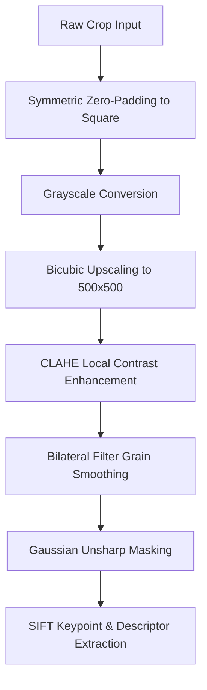

# Leopard Toad Re-Identification Framework (HotSpotter)

This framework uses optimized Scale-Invariant Feature Transform (**SIFT**) keypoint descriptors, Fast Library for Approximate Nearest Neighbors (**FLANN**) feature matching, and Random Sample Consensus (**RANSAC**) spatial verification, augmented by a state-of-the-art computer vision preprocessing pipeline.

---

## 🌟 Key Features

* **Advanced Computer Vision Preprocessing Pipeline:** Integrates custom aspect-ratio-preserving padding, bicubic upscaling, local CLAHE enhancement, bilateral noise filtering, and high-frequency unsharp masking to elevate SIFT match performance on low-light night-time sensors.
* **Optimized SIFT Parameters:** Tailored SIFT settings (`contrastThreshold=0.02`, `edgeThreshold=15`) to capture micro-level spot edges and boundaries.
* **Cross-Tunnel Same-Year Matching:** Restricts spatial searches strictly within same-year cohorts (e.g., 2023, 2024, 2025) and enforces matching exclusively between opposite ends of migratory road-underpass tunnels (**Z** cameras vs. **R** cameras).
* **Fully Modular & Configurable:** Zero hardcoded paths. All settings—from directory structures to filtering sigmas and RANSAC thresholds—are centralized in `config.py`.

---

## 🛠️ Preprocessing Pipeline Architecture

Raw cropped images of toads are often low-contrast, grainy, or geometrically distorted. The framework applies a multi-stage preprocessing chain before feature extraction:



1. **Aspect-Ratio-Preserving Padding:** Rectangular crops are padded symmetrically with black borders to preserve pattern proportions and prevent geometric distortion during resizing.
2. **Bicubic Upscaling:** Upscales small crops to a uniform $500 \times 500$ resolution using `cv2.INTER_CUBIC` to amplify fine boundary details.
3. **CLAHE:** Applies Contrast Limited Adaptive Histogram Equalization (`clipLimit=2.0`, `tileGrid=(8, 8)`) to equalize local brightness variation and enhance low-contrast skin pigments.
4. **Bilateral Filtering:** Smooths out image grain and high-frequency sensor noise (`d=9`, `sigmaColor=75`, `sigmaSpace=75`) while maintaining sharp transitions.
5. **Unsharp Masking:** Applies an unsharp mask using a Gaussian kernel (`kernel=(9, 9)`, `sigma=10.0`, `weights=(1.5, -0.5)`) to accentuate boundaries between dark toad spots and light skin.

---

## 📊 Preprocessing Impact on SIFT

Applying this pipeline yields a massive performance boost over matching raw crops:

| Metric | Raw Crops | Preprocessed & Optimized | % Improvement |
| :--- | :---: | :---: | :---: |
| **SIFT Keypoints Detected (Sample)** | 713 | **1,244** | **+174.5%** |
| **Total Confident Cross-Tunnel Matches** | 7 | **73** | **+942.8%** |

> [!TIP]
> The dramatic increase in match count allows the conservation framework to track individuals moving across migratory tunnels with extremely high confidence, even with changing night-time lighting.

---

## 📂 Directory & Package Structure

```
identification/hotspotter/
├── __init__.py                # Package entry point
├── config.py                  # Centralized system configurations & parameters
├── matcher.py                 # Core SIFT, FLANN, and RANSAC matcher class
├── run_cross_tunnel_hotspotter.py # Main CLI script to perform cross-tunnel same-year matching
└── batch_hotspotter.py        # Legacy utility for NxN combinations matching
```

* **`config.py`**: Centralizes paths, SIFT edge thresholds, bilateral filters, unsharp masking constants, and FLANN/RANSAC configurations.
* **`matcher.py`**: Contains the `BatchHotSpotter` class, responsible for `get_features(image_path)` (applying the full preprocessing chain) and `match_features(kp1, des1, kp2, des2)` (performing FLANN matching, Lowe's ratio test, and homography evaluation).
* **`run_cross_tunnel_hotspotter.py`**: Classifies crop cameras into `Z` or `R` categories, parses matching year blocks, runs cross-tunnel matching, and saves high-confidence pairs to `cross_tunnel_matches.csv`.

---

## 🚀 Execution Guide

### 1. Preprocessing and Cropping
To generate preprocessed toad crops from the prediction list, run the dataset utility:
```bash
python dataset/crop_images.py --csv detection/results/detect_rtdetr_cycle2_clahe_pretrained/wlt_predictions.csv --output-dir identification/data/wlt_predictions_crops --clahe
```

### 2. Running Cross-Tunnel Re-Identification
To run the re-identification matching engine over all crop cohorts:
```bash
# Navigate to the hotspotter folder
cd identification/hotspotter

# Run the cross-tunnel matching pipeline
python run_cross_tunnel_hotspotter.py
```

Results containing matched Z/R crop pairs, confidence scores, and original image paths will be saved directly to [cross_tunnel_matches.csv](file:///home/Joshua/Downloads/leopard_toad_identification/identification/cross_tunnel_matches.csv).

### 3. Generating Premium Visualizations (PDF Report)
To compile a high-quality PDF report showing visual matches with green inlier keypoint connection vectors against a sleek, presentation-ready dark layout:
```bash
# From the hotspotter folder
python visualize_matches.py
```

The resulting multi-page PDF document will be compiled and saved directly as `identification/top_3_cross_tunnel_matches.pdf`.

---

## 🛡️ Spatial Verification Details

Lowe's ratio test filters out ambiguous descriptor matches by ensuring the best match is significantly closer than the second best. The remaining matches undergo spatial homography filtering:
$$H = \text{findHomography}(pts_1, pts_2, \text{RANSAC}, 5.0)$$
Pairs with an inlier count (homography mask sum) $\ge 15$ are classified as highly confident positive matches.
